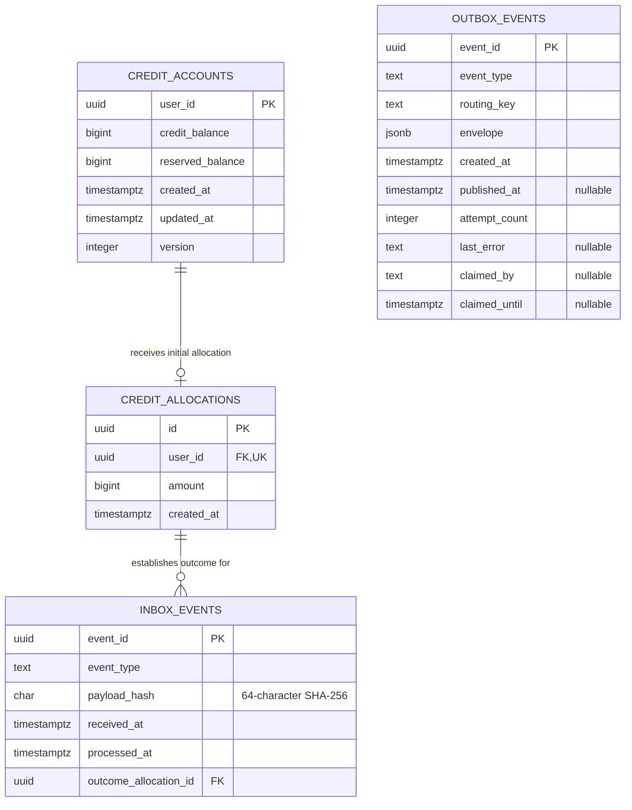

# Credit Service

Credit Service owns credit accounts and their persistent balance history. It
currently consumes `UserRegistered`, creates the user's account and immutable
initial allocation, and eventually publishes `CreditAccountInitialised`.

The service is built with NestJS and TypeScript, PostgreSQL with TypeORM, and
RabbitMQ. Event payloads are validated with versioned JSON Schemas and AJV.

## How account initialization works

1. Root broker definitions create the durable Credit Service subscription and
   bind `user.registered.v1` from the shared `foc.events` direct exchange, so
   RabbitMQ can buffer registrations before Credit Service starts.
2. The transport validates the JSON transport metadata, and the handler
   validates the event envelope and payload contract.
3. A PostgreSQL `SERIALIZABLE` transaction deduplicates the event, creates or
   locates the account and allocation, records the inbox outcome, and stores a
   pending `CreditAccountInitialised` envelope in the outbox when the account is
   new.
4. The incoming delivery is acknowledged only after the database transaction
   commits.
5. The outbox relay publishes the stored envelope and marks it published only
   after RabbitMQ confirms it.

This produces at-least-once delivery. A message may be published again after an
uncertain failure, so event consumers must be idempotent. See the
[Credit Service ADRs](../docs/adr/credit-service/README.md) for the persistence,
containerization, and messaging decisions and the complete topology diagram.

## Prerequisites

- Node.js 22
- npm 11.18.0
- Docker with Docker Compose

Run npm commands in `credit-service`. Run the normal application stack from the
repository root; service-local Compose profiles are reserved for tests.

## Local setup

Create the service-local environment and secret files:

```powershell
Copy-Item .env.example .env
Copy-Item secrets/credit_db_password.secret.example secrets/credit_db_password.secret
Copy-Item secrets/rabbitmq_password.secret.example secrets/rabbitmq_password.secret
```

Replace both example secrets. Generate the RabbitMQ password hash with
`rabbitmqctl hash_password`, then update only the `credit-service` hash in the
root broker definitions so it matches the ignored secret. Never commit the
actual password. Every variable read by the service is documented in
[.env.example](./.env.example).

Install the locked dependencies:

```powershell
npm ci
```

## Run with Docker Compose

From the repository root, start the shared broker and Credit database, build
Credit Service, apply its migrations, and then start the application:

```powershell
docker compose up -d --wait rabbitmq credit-db
docker compose build credit-service
docker compose run --rm credit-service npm run migration:run
docker compose up -d credit-service
```

Applying migrations before starting the application prevents consumers and the
outbox relay from accessing an empty schema. TypeORM schema synchronization is
intentionally disabled.

The temporary HTTP root endpoint is available at
`http://localhost:3003/` by default. Follow the service logs or stop the stack
with:

```powershell
docker compose logs -f credit-service
docker compose down
```

Credit Service authenticates to `/foc` as `credit-service`. Its password is
mounted at `/run/secrets/rabbitmq_password_credit_service`; it is never placed
in the container environment. Docker builds use the repository root as their
build context so canonical event schemas are available during compilation.

## Testing

The test commands deliberately separate fast source-level checks from tests
that exercise real infrastructure.

| Test type | Command | Infrastructure | What it verifies |
| --- | --- | --- | --- |
| Unit | `npm test` | None | Services, validators, configuration, transaction retry logic, lifecycle wiring, and RabbitMQ/outbox behavior through fakes |
| Unit coverage | `npm run test:cov` | None | The same `src/**/*.spec.ts` unit suite with V8 coverage |
| PostgreSQL integration | `npm run test:integration` | Isolated PostgreSQL on port `5436` | Migrations, constraints, immutable allocations, repositories, account initialization, inbox/outbox atomicity, concurrency, and relay claims |
| HTTP end-to-end | `npm run test:e2e` | Isolated PostgreSQL on port `5436`; no RabbitMQ | The real NestJS `AppModule` and HTTP endpoint; broker components are replaced with no-op test providers |
| RabbitMQ messaging integration | `npm run test:messaging` | RabbitMQ on port `5675` | Real queue topology, multiple stream isolation, retries, DLQs, manual acknowledgements, confirmed publication, and shutdown |
| Shared-broker permissions | `npm run test:rabbitmq-permissions` | Root RabbitMQ on port `5672` | The Credit identity's allowed topology, consumption, and publication operations, plus denial of shared-exchange configuration and Email resources |
| Messaging recovery | `npm run test:recovery` | Disposable PostgreSQL and RabbitMQ on ports `5437`, `5676`, and `15676` by default | The complete broker-to-database-to-outbox pipeline, idempotency, acknowledgement ordering, application restart, and live infrastructure recovery |

All test commands synchronize the source-time contract cache before Vitest
runs. Integration suites that share infrastructure run sequentially.

### Unit tests

Unit tests include only `src/**/*.spec.ts` and do not require Docker:

```powershell
npm test
```

For local iteration and diagnostics:

```powershell
npm run test:watch
npm run test:cov
npm run test:debug
```

These tests use mocks and in-memory fakes. They verify application behavior but
do not prove PostgreSQL constraints or RabbitMQ delivery semantics.

### PostgreSQL integration tests

The database integration suite uses the `credit-db-test` Compose service. Its
data directory is a `tmpfs`, so it neither shares nor persists development data:

```powershell
npm run db:test:up
npm run test:integration
npm run db:test:down
```

The suite starts from an empty database, applies the committed migration,
tests the real PostgreSQL schema and concurrent use cases, and verifies that the
migration reverts cleanly. Keep `credit-db-test` running if the HTTP end-to-end
suite will run next.

### HTTP end-to-end tests

The HTTP suite boots the real `AppModule` and tests the temporary root endpoint:

```powershell
npm run db:test:up
npm run test:e2e
npm run db:test:down
```

It intentionally overrides the RabbitMQ consumer transport and outbox relay.
This keeps the HTTP smoke test deterministic and broker-independent; use the
messaging and recovery suites for broker behavior and the complete event flow.

### RabbitMQ messaging integration tests

Start the service-local broker, then run the real-AMQP transport and publisher
tests:

```powershell
docker compose --profile test up -d --wait credit-rabbitmq
npm run test:messaging
```

Each run creates uniquely named exchanges and queues and removes them afterward.
The tests cover two subscriptions to prove handler, retry-chain, and DLQ
isolation. They do not use PostgreSQL or start the complete NestJS application.
The `RABBITMQ_URL` variable is retained only for these isolated test tools; the
running application constructs its URL from component settings and a secret
file.

To verify least-privilege permissions against a fresh root broker, point the
documented component settings at the host-published broker and run:

```powershell
$env:RABBITMQ_HOST = '127.0.0.1'
$env:RABBITMQ_PASSWORD_FILE = './secrets/rabbitmq_password.secret'
npm run test:rabbitmq-permissions
```

The verifier creates only uniquely named, auto-delete queues in the
`credit-service.*` namespace. It never deletes or reconfigures shared broker
resources.

### Messaging recovery tests

The recovery command orchestrates its own isolated infrastructure:

```powershell
npm run test:recovery
```

It builds and starts recovery-only PostgreSQL and RabbitMQ containers, migrates
an empty database, starts the real application modules, and exercises the full
consumer, validation, transaction, inbox, allocation, outbox, relay, and
confirmed-publication path. It also restarts the application and both
infrastructure containers to verify reconnection and pending-outbox recovery.

The command always attempts to remove the recovery containers and their
anonymous volumes on success, failure, or interruption. It requires Docker,
the service-local database secret, and `RABBITMQ_PASSWORD` in `.env`, but does
not use the development database or RabbitMQ volumes.

### Build and static checks

```powershell
npm run build
npm run lint
npm run format
```

`npm run format` rewrites matching TypeScript files with Prettier. Build, lint,
and unit tests do not replace the PostgreSQL, RabbitMQ, or recovery suites.

## RabbitMQ subscriptions and retries

The root broker owns the shared `foc.events` direct exchange and predeclares
the critical `credit-service.user-registered.v1` queue with its exact
`user.registered.v1` binding. This gives registrations a durable landing point
before Credit Service starts. Credit Service checks the shared exchange
passively, then idempotently reasserts that main queue and binding along with
the rest of its service-owned topology during startup and connection recovery.
Its credential cannot create, delete, or alter `foc.events`.

Credit currently consumes exactly `user.registered.v1` and publishes exactly
`credit.account-initialised.v1`; typed configuration rejects other values. The
deployed main queue name is also fixed outside tests so configuration cannot
bypass the predeclared subscription. Isolated tests may use unique queue names.

RabbitMQ resource permissions protect exchange and queue names, but do not
restrict individual routing keys on a direct exchange. Contract validation,
explicit subscriptions, configuration validation, and tests therefore enforce
the application's routing-key allowlist. Direct routing removes wildcard
matching, but multiple queues can deliberately bind the same exact key and all
receive the original publication.

Credit Service uses one recovering consumer connection while giving every
incoming event stream its own durable queue, handler, and consumer channel. A
stream queue named `<queue>` owns:

- retry queues `<queue>.retry.1` through `<queue>.retry.5`;
- a dead-letter queue `<queue>.dlq`, unless explicitly overridden;
- an independent `RABBITMQ_PREFETCH` allowance.

The domain exchange, direct retry exchange, direct retry-return exchange,
direct dead-letter exchange, and confirm-publisher channel are shared within
the transport. New domain events arrive through `foc.events`. Failures enter
the TTL queues through `foc.credit.retry`, then expire through
`foc.credit.back` using the main queue name as the routing key. That
queue-identity return route sends a retry only to the stream that failed; it
cannot fan out again to other queues bound to the same domain routing key.
Malformed messages, permanent contract failures, and exhausted retries go
only to that stream's DLQ. Retry and dead-letter publications are confirmed
before the original delivery is acknowledged.

Because prefetch applies per subscription, the effective process-wide delivery
allowance is the subscription count multiplied by `RABBITMQ_PREFETCH`. The
former global `RABBITMQ_DEAD_LETTER_QUEUE` variable is no longer read. Before
deploying this topology, drain or migrate any custom legacy DLQ whose name does
not match `<queue>.dlq`.

### Hybrid topology ownership and rollout

Only the main `credit-service.user-registered.v1` queue and its binding from
`foc.events` are seeded by the root definitions. Credit Service remains the
owner of its subscription behavior and declares the same main queue and
binding at runtime. Its retry, retry-return, and dead-letter exchanges, five
retry queues, returned-retry binding, and DLQ remain runtime-created resources.

Deploy a new or changed critical subscription in this order:

1. Import or deploy the root broker definitions containing the durable main
   queue and exact domain binding.
2. Verify the queue and binding before enabling its producer.
3. Deploy Credit Service; its matching declarations must succeed without
   changing the predeclared resources.
4. Enable or deploy the producer for that event.

Existing installations require no queue deletion for this change. If Credit
already created the canonical queue and binding with the same properties, the
definition import is idempotent. Keep existing main, retry, and dead-letter
queues and their messages. A fresh broker creates the main queue before Credit
starts, but recreating broker definitions after deleting broker storage cannot
restore messages that were stored in that deleted volume.

### Retry topology migration

RabbitMQ stores a queue's dead-letter exchange and routing key in its queue
declaration. Existing retry queues therefore cannot be redeclared in place
with the new return route. For each deployed Credit Service environment:

1. Stop Credit Service so it cannot create new retries.
2. Wait at least the longest configured retry delay and confirm that every
   `<queue>.retry.1..5` queue is empty. Pending retries will have returned to
   their main queue.
3. Delete only the five retry queues for each subscription. Keep the main
   queues and DLQs.
4. Start the updated service; it recreates the retry queues with
   `foc.credit.back` and queue-identity routing.

If an old retry queue remains, startup intentionally fails with RabbitMQ's
inequivalent-argument error instead of retaining the unsafe route. See
RabbitMQ's [dead-letter exchange documentation](https://www.rabbitmq.com/docs/dlx).

### Shared exchange migration

No exchange migration is needed for a broker created from the current root
definitions because `foc.events` is already direct. RabbitMQ cannot change an
existing exchange's type in place. If an environment previously created
`foc.events` as topic, use a maintenance window:

1. Stop User, Email, and Credit Service publishers and consumers.
2. Drain pending retry queues and export the broker definitions as a backup.
3. Delete only `foc.events`; retain its bound queues and their messages.
4. Import or start the updated root definitions to recreate `foc.events` as a
   durable direct exchange and provision the Credit Service identity.
5. Start User and Email Services, then Credit Service.
6. Confirm the expected queue bindings before resuming traffic.

Do not remove broker volumes or service queues as part of this migration.
Recreate every required exact binding before resuming traffic.

## Database model

The current schema supports account initialization, incoming-event
deduplication, and transactional outbox publication:



An account can have at most one initial allocation because
`credit_allocations.user_id` is unique. Multiple valid registration events for
the same user can reference that original allocation through
`inbox_events.outcome_allocation_id`. Allocation rows are immutable: a database
trigger rejects updates and deletions.

`outbox_events` intentionally has no foreign key to the account or allocation.
It stores the complete validated event envelope as the authoritative
publication payload and tracks claim and publication state independently.
Reservation persistence and the future `credit_transactions` ledger are not
part of the current schema.

## Persistence guarantees

- `credit_balance` is the credit available to spend.
- `reserved_balance` is credit held for future transactions; reservation
  behavior is not implemented yet.
- PostgreSQL `BIGINT` stores balances and allocation amounts. Values outside
  JavaScript's safe-integer range are rejected at the application boundary.
- Database checks enforce non-negative balances and positive allocations.
- Initial allocations are separate from future credit transactions and are
  immutable at the database level.
- Account allocation is idempotent and never reapplies the configured amount
  to an existing account.
- Allocation use cases require a caller-owned transaction so account, inbox,
  and outbox writes share one atomic boundary.
- Inbox rows deduplicate event IDs using the event type and a canonical payload
  hash. Conflicting reuse of an event ID is dead-lettered.
- Different registration event IDs for one user link to the original
  allocation without creating another account, allocation, or initialization
  event.
- The shared `SERIALIZABLE` transaction runner retries PostgreSQL serialization
  failures and deadlocks up to three times.
- Relay workers claim disjoint outbox batches with expiring PostgreSQL leases.
  Failed publications are released and retried indefinitely.
- Outbox rows are marked published only after RabbitMQ confirmation. Stale rows
  are logged by event ID and operational diagnostics without logging their
  envelope.

## Event contracts

Versioned JSON Schemas under the repository-root `contracts/schemas` directory
define the common envelope, `UserRegistered`, and
`CreditAccountInitialised`. This directory is the canonical source of truth.
Credit Service copies only the contracts it consumes or publishes.

The npm lifecycle hooks synchronize schemas into the ignored
`src/contracts/schemas` cache before source-mode commands and into
`dist/contracts/schemas` after a build:

```powershell
npm run contracts:sync:source
npm run contracts:sync:dist
```

Production loads only the bundled `dist` copies and never depends on the
repository root at runtime. Restart a host-based `npm run start:dev` process
after changing a canonical schema. Docker Compose watches the canonical schema
directory and restarts the development container automatically.

Contracts reject unknown envelope and payload properties. IDs must be UUIDs,
timestamps must be RFC 3339 date-times ending in uppercase `Z`, and validation
errors expose sanitized violations without payload values.

## Publish a registration fixture

With PostgreSQL migrated and Credit Service and RabbitMQ running, publish the
committed valid `UserRegistered` fixture and wait for broker confirmation:

```powershell
npm run event:publish:user-registered
```

The script publishes the exact bytes from
`test/fixtures/user-registered.v1.json` using `RABBITMQ_URL`,
`RABBITMQ_EXCHANGE`, and `RABBITMQ_USER_REGISTERED_ROUTING_KEY`. Publishing the
same fixture again demonstrates event-ID idempotency.

To initialize another account, copy the fixture and replace both `eventId` and
`payload.userId`, then provide its path:

```powershell
node scripts/publish-event-fixture.mjs test/fixtures/my-registration.json
```

## Migrations

TypeORM uses [data-source.ts](./src/database/data-source.ts) for CLI commands.
The CLI reads `DB_HOST`, `DB_PORT`, `DB_USERNAME`, `DB_DATABASE`, and
`DB_PASSWORD_FILE` from the environment or service-local `.env` file.

```powershell
npm run migration:show
npm run migration:run
npm run migration:revert
npm run migration:generate -- src/database/migrations/DescribeChange
npm run migration:create -- src/database/migrations/DescribeChange
```

For host-side CLI commands, use `DB_HOST=127.0.0.1`, the published port (`5435`
for development or `5436` for database tests), and
`DB_PASSWORD_FILE=./secrets/credit_db_password.secret`. Inside Compose, use
`DB_HOST=credit-db`, `DB_PORT=5432`, and the container secret path.

Production images provide `migration:run:prod`, `migration:show:prod`, and
`migration:revert:prod`, which use the compiled data source in `dist`.
