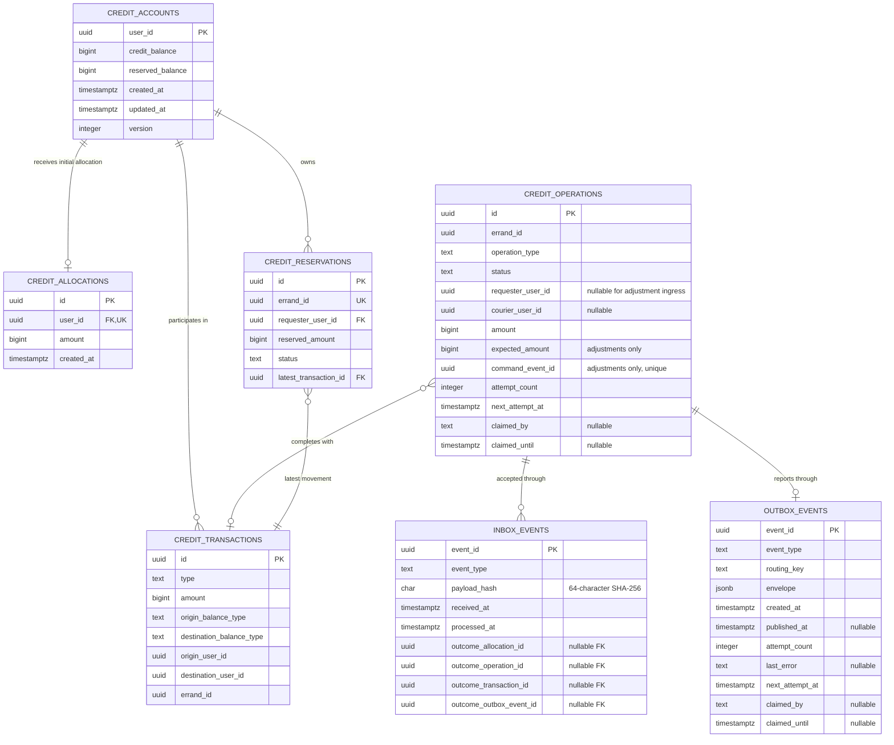

# Credit Service

Credit Service owns credit accounts and their persistent balance history. It
consumes account-registration, reservation, and reservation-adjustment
commands; persists durable processing evidence; publishes transactional
outcomes; and serves protected balance and advisory sufficiency reads.

The service is built with NestJS and TypeScript, PostgreSQL with TypeORM, and
RabbitMQ. Event payloads are validated with versioned JSON Schemas and AJV.

## How account initialization works

1. Root broker definitions create the durable Credit Service subscription and
   bind `user.registered.v1` from the shared `foc.events` direct exchange, so
   RabbitMQ can buffer registrations before Credit Service starts.
2. The transport validates the JSON transport metadata, and the handler
   validates the event envelope and payload contract.
3. A PostgreSQL `SERIALIZABLE` transaction deduplicates the event, creates or
   locates the account and allocation, records the inbox outcome, and stores a
   pending `CreditAccountInitialised` envelope in the outbox when the account is
   new.
4. The incoming delivery is acknowledged only after the database transaction
   commits.
5. The outbox relay publishes the stored envelope and marks it published only
   after RabbitMQ confirms it.

This produces at-least-once delivery. A message may be published again after an
uncertain failure, so event consumers must be idempotent. See the
[Credit Service ADRs](../docs/adr/credit-service/README.md) for the persistence,
containerization, and messaging decisions and the complete topology diagram.

## How reservations and adjustments work

### Reservation

`CreditReservation` uses durable ingress followed by asynchronous execution:

1. The consumer validates the complete shared event contract.
2. A serializable ingress transaction deduplicates the event ID and establishes
   one semantic `RESERVE` operation per errand. A new valid command is stored as
   `PENDING` together with its inbox row.
3. RabbitMQ is acknowledged only after that ingress transaction commits. No
   balance movement has happened yet.
4. A worker claims due operations in batches using `FOR UPDATE SKIP LOCKED`, a
   worker UUID, and an expiring lease.
5. The worker locks the operation, errand, account, and reservation state and
   either completes the movement or records a permanent business rejection in
   one serializable transaction.
6. Success moves available credit to reserved credit, appends one immutable
   `RESERVATION` ledger transaction, creates an `ACTIVE` reservation, marks the
   operation `SUCCEEDED`, and writes `CreditReservationSuccess` to the outbox.
7. A business failure changes no balance and creates no ledger transaction. It
   marks the operation `REJECTED` and writes `CreditReservationRejected` to the
   outbox.

Technical failures are not business rejections. They leave the operation
`PENDING`, store only sanitized diagnostics, release or expire the claim, and
schedule exponential retry capped by `CREDIT_OPERATION_MAX_BACKOFF_MS`. There
is no terminal attempt limit. A process that dies while holding a claim loses
ownership when the lease expires, after which another worker can continue.

A pending operation, active reservation, and overdue warning mean different
things:

- `PENDING` is execution state: Credit accepted the command durably but has not
  yet produced an authoritative result.
- `ACTIVE` is financial state: the successful reservation currently owns the
  recorded amount in the requester's reserved balance.
- An overdue warning is operational telemetry emitted when a pending
  operation exceeds `CREDIT_OPERATION_STUCK_AFTER_MS`; it does not change the
  operation status or stop retries.

Reservation business rejection reasons are:

| Reason                 | Meaning                                                                     |
| ---------------------- | --------------------------------------------------------------------------- |
| `MISSING_BALANCE`      | The requester has no Credit account.                                        |
| `INSUFFICIENT_CREDITS` | Available credit cannot cover the reservation.                              |
| `RESERVATION_CONFLICT` | The errand already has incompatible reservation state or command semantics. |

### Reservation adjustment

`CreditReservationAdjustment` uses the same durable-ingress boundary as
reservations, but each distinct event ID creates its own repeatable `ADJUST`
operation. The consumer validates the command, persists a `PENDING` operation
and inbox row, and acknowledges RabbitMQ after that transaction commits. No
financial state is read or changed during ingress.

The leased operation worker resolves the active reservation, locks its
requester account and then revalidates the reservation, treats `oldAmount` as a
concurrency precondition, and uses the stored reservation amount as
authoritative. An increase moves the positive difference from available to
reserved; a decrease moves it back. An effective change appends one immutable
`RESERVATION_ADJUSTMENT` transaction and updates the reservation's amount and
latest transaction reference. An equal target amount succeeds without another
movement and references the latest transaction.

Adjustment business rejection reasons are:

| Reason                     | Meaning                                               |
| -------------------------- | ----------------------------------------------------- |
| `RESERVATION_NOT_FOUND`    | No active reservation exists for the errand.          |
| `STALE_RESERVATION_AMOUNT` | `oldAmount` does not match Credit's stored amount.    |
| `INSUFFICIENT_CREDITS`     | An increase exceeds the requester's available credit. |

Business rejections are terminal operation results: operation, inbox, and
outbox evidence commit atomically with no balance movement. A DLQ entry instead
means Credit could not accept the command contract or transport identity, such
as malformed JSON, an invalid schema, a routing mismatch, or conflicting reuse
of one event ID. Technical failures enter bounded broker retry only until
durable ingress; persisted reservation and adjustment operations are then
retried independently by the worker without a terminal attempt limit.

Adjustment commands are idempotent by event ID. Redelivery with the same event
ID and payload links to the stored operation without another operation or
outcome; reuse of that ID with different content is dead-lettered. A different
event ID is a fresh durable command evaluated against current state, even if
its payload matches an earlier adjustment. Repeating a successful effective
transition will normally be rejected as `STALE_RESERVATION_AMOUNT`, while an
earlier business rejection can be retried under a new event ID and may succeed
after state changes. A fresh no-op command publishes a fresh success outcome
but does not create a ledger entry.

All inbound delivery and outbound publication is at least once. Duplicate
event IDs never reapply state. A distinct equivalent reservation command links
to the established semantic operation and replays its outcome without another
balance movement or ledger entry. This semantic replay does not apply to
adjustments with distinct event IDs. Consumers of Credit outcomes must also
deduplicate by event ID.

For every account, the sum of `reserved_amount` across its `ACTIVE`
reservations must equal `credit_accounts.reserved_balance`. This reconciliation
invariant is checked by integration tests and must remain true after every
successful reservation or adjustment.

Credit Service does not currently expose an errand-operation status endpoint.
Order Service consumes outcome events and remains the frontend's normal read
model. A requester-authorized status endpoint may be added later if a concrete
debugging, support, or reconciliation need appears; it must not become a
synchronous correctness dependency.

## Reservation event topology

| Direction | Event                                 | Routing key                                 | Credit queue                                      |
| --------- | ------------------------------------- | ------------------------------------------- | ------------------------------------------------- |
| Consume   | `CreditReservation`                   | `credit.reservation.v1`                     | `credit-service.credit-reservation.v1`            |
| Consume   | `CreditReservationAdjustment`         | `credit.reservation-adjustment.v1`          | `credit-service.credit-reservation-adjustment.v1` |
| Publish   | `CreditReservationSuccess`            | `credit.reservation-success.v1`             | Subscriber-owned                                  |
| Publish   | `CreditReservationRejected`           | `credit.reservation-rejected.v1`            | Subscriber-owned                                  |
| Publish   | `CreditReservationAdjustmentSuccess`  | `credit.reservation-adjustment-success.v1`  | Subscriber-owned                                  |
| Publish   | `CreditReservationAdjustmentRejected` | `credit.reservation-adjustment-rejected.v1` | Subscriber-owned                                  |

Command payloads are:

```json
{ "errandId": "<uuid>", "requesterUserId": "<uuid>", "amount": 25 }
```

```json
{ "errandId": "<uuid>", "oldAmount": 25, "newAmount": 40 }
```

Outcome payloads are respectively:

- success: `{ errandId, requesterUserId, reservedAmount, creditTransactionId }`
- rejection: `{ errandId, requesterUserId, requestedAmount, rejectionReason }`
- adjustment success: `{ errandId, newReservedAmount, creditTransactionId }`
- adjustment rejection: `{ errandId, requestedAmount, rejectionReason }`

## Prerequisites

- Node.js 22
- npm 11.18.0
- Docker with Docker Compose

Run npm commands in `credit-service`. Run the normal application stack from the
repository root; service-local Compose profiles are reserved for tests.

## Local setup

Create the service-local environment and secret files:

```powershell
Copy-Item .env.example .env
Copy-Item secrets/credit_db_password.secret.example secrets/credit_db_password.secret
Copy-Item secrets/rabbitmq_password.secret.example secrets/rabbitmq_password.secret
```

Replace both example secrets. Generate the RabbitMQ password hash with
`rabbitmqctl hash_password`, then update only the `credit-service` hash in the
root broker definitions so it matches the ignored secret. Never commit the
actual password. Every variable read by the service is documented in
[.env.example](./.env.example).

Credit Service also mounts User Service's RS256 public key from
`user-service/jwt_public_key.secret`. Generate the User Service signing keypair
before starting either service; only the public key is made available to Credit
Service through `JWT_PUBLIC_KEY_FILE`.

Install the locked dependencies:

```powershell
npm ci
```

## Run with Docker Compose

From the repository root, start the shared broker and Credit database, build
Credit Service, apply its migrations, and then start the application:

```powershell
docker compose up -d --wait rabbitmq credit-db
docker compose build credit-service
docker compose run --rm credit-service npm run migration:run
docker compose up -d credit-service
```

Applying migrations before starting the application prevents consumers and the
outbox relay from accessing an empty schema. TypeORM schema synchronization is
intentionally disabled.

Swagger UI is available at `http://localhost:3003/docs` and the generated
OpenAPI document at `http://localhost:3003/docs-json` by default. Follow the
service logs or stop the stack with:

```powershell
docker compose logs -f credit-service
docker compose down
```

Credit Service authenticates to `/foc` as `credit-service`. Its password is
mounted at `/run/secrets/rabbitmq_password_credit_service`; it is never placed
in the container environment. Docker builds use the repository root as their
build context so the repository-local `@foc/contracts` and `@foc/auth`
dependencies can be built and packaged into the service image.

## Protected read APIs

Credit Service exposes two authenticated, self-only endpoints:

| Method | Path                      | Purpose                                                               |
| ------ | ------------------------- | --------------------------------------------------------------------- |
| `GET`  | `/v1/credits/balance`     | Return the authenticated user's available and reserved credit.        |
| `POST` | `/v1/credits/sufficiency` | Advise whether the current available credit covers a positive amount. |

Both endpoints accept a User Service access token from the `access_token`
cookie or `Authorization: Bearer <token>`. When both are present, the shared
`@foc/auth` extractor uses the cookie. Credit Service verifies RS256 signatures
with the mounted public key, requires issuer `user-service`, and validates the
complete shared claim contract: UUID `sub`, `email`, `displayName`,
boolean `isAdmin`, participant `roles`, `iat`, and `exp`. The roles array may be
empty because these routes authorize by authenticated subject, not role.

Credit Service only reads the cookie. User Service is responsible for creating,
refreshing, and clearing it. Credit Service never receives the private signing
key and never calls User Service synchronously to authenticate a request.

### Read the current balance

The user ID is taken only from the verified token:

```sh
curl http://localhost:3003/v1/credits/balance \
  --header "Authorization: Bearer $ACCESS_TOKEN"
```

```json
{
  "userId": "11111111-1111-4111-8111-111111111111",
  "creditBalance": 100,
  "reservedBalance": 0
}
```

`creditBalance` is currently available to spend. `reservedBalance` is already
held for future work. A user without a Credit account receives
`404 CREDIT_ACCOUNT_NOT_FOUND`.

### Check point-in-time sufficiency

The request's `userId` must equal the verified token's `sub` claim:

```sh
curl --request POST http://localhost:3003/v1/credits/sufficiency \
  --header "Authorization: Bearer $ACCESS_TOKEN" \
  --header "Content-Type: application/json" \
  --data '{"userId":"11111111-1111-4111-8111-111111111111","amount":50}'
```

```json
{
  "userId": "11111111-1111-4111-8111-111111111111",
  "amount": 50,
  "sufficient": true
}
```

Equality is sufficient. The query does not lock the account, change either
balance, increment the account version, reserve credit, or write inbox, outbox,
allocation, or transaction records.

The result is advisory and can become stale immediately. Order Service must not
treat it as authorization or as a correctness precondition for a reservation.
The reservation worker re-reads and locks the account, then repeats the balance
check inside its own balance-changing transaction.

### Errors and OpenAPI

Errors use a stable JSON envelope:

| Status | Code                       | When                                                                                                         |
| ------ | -------------------------- | ------------------------------------------------------------------------------------------------------------ |
| `400`  | `VALIDATION_ERROR`         | The body is malformed, contains unknown fields, or violates field constraints.                               |
| `401`  | `INVALID_ACCESS_TOKEN`     | The access token is missing, malformed, expired, incorrectly signed, or violates the shared claims contract. |
| `403`  | `SUBJECT_MISMATCH`         | A sufficiency request names a user other than the authenticated subject.                                     |
| `404`  | `CREDIT_ACCOUNT_NOT_FOUND` | No Credit account exists for the authenticated user.                                                         |

Validation errors may include safe `field` and `reason` entries. Rejected
values, JWTs, signatures, and key material are never echoed. Swagger UI at
`/docs` and the OpenAPI JSON at `/docs-json` document both cookie and bearer
inputs as alternatives, along with request, success, and error examples.

## Testing

The test commands deliberately separate fast source-level checks from tests
that exercise real infrastructure.

| Test type                      | Command                             | Infrastructure                                                                     | What it verifies                                                                                                                                                          |
| ------------------------------ | ----------------------------------- | ---------------------------------------------------------------------------------- | ------------------------------------------------------------------------------------------------------------------------------------------------------------------------- |
| Unit                           | `npm test`                          | None                                                                               | Services, protected HTTP behavior and OpenAPI, contract integration, configuration, transaction retry logic, lifecycle wiring, and RabbitMQ/outbox behavior through fakes |
| Unit coverage                  | `npm run test:cov`                  | None                                                                               | The same `src/**/*.spec.ts` unit suite with V8 coverage                                                                                                                   |
| PostgreSQL integration         | `npm run test:integration`          | Isolated PostgreSQL on port `5436`                                                 | Migrations, constraints, immutable ledger behavior, account initialization, reservations, adjustments, inbox/outbox atomicity, concurrency, and reconciliation            |
| HTTP end-to-end                | `npm run test:e2e`                  | Isolated PostgreSQL on port `5436`; no RabbitMQ                                    | The real NestJS `AppModule` and generated OpenAPI paths; broker components are replaced with no-op test providers                                                         |
| RabbitMQ messaging integration | `npm run test:messaging`            | RabbitMQ on port `5675`                                                            | Real queue topology, multiple stream isolation, retries, DLQs, manual acknowledgements, confirmed publication, and shutdown                                               |
| Shared-broker permissions      | `npm run test:rabbitmq-permissions` | Root RabbitMQ on port `5672`                                                       | The Credit identity's allowed topology, consumption, and publication operations, plus denial of shared-exchange configuration and Email resources                         |
| Messaging recovery             | `npm run test:recovery`             | Disposable PostgreSQL and RabbitMQ on ports `5437`, `5676`, and `15676` by default | Account and reservation pipelines, durable ingress, expired claims, pending outbox publication, idempotency, application restart, and live infrastructure recovery        |

All source-mode commands rebuild `@foc/contracts` and `@foc/auth` before
running. Their own suites run from `packages/contracts` and `packages/auth`;
integration suites that share infrastructure run sequentially.

### Unit tests

Unit tests include only `src/**/*.spec.ts` and do not require Docker:

```powershell
npm test
```

For local iteration and diagnostics:

```powershell
npm run test:watch
npm run test:cov
npm run test:debug
```

These tests use mocks and in-memory fakes. They verify application behavior but
do not prove PostgreSQL constraints or RabbitMQ delivery semantics.

### PostgreSQL integration tests

The database integration suite uses the `credit-db-test` Compose service. Its
data directory is a `tmpfs`, so it neither shares nor persists development data:

```powershell
npm run db:test:up
npm run test:integration
npm run db:test:down
```

The suite starts from an empty database, applies the committed migrations,
tests the real PostgreSQL schema and concurrent use cases, and verifies that the
migration reverts cleanly. Keep `credit-db-test` running if the HTTP end-to-end
suite will run next.

### HTTP end-to-end tests

The HTTP suite boots the real `AppModule` and verifies that the generated
OpenAPI document publishes both protected Credit paths:

```powershell
npm run db:test:up
npm run test:e2e
npm run db:test:down
```

It intentionally overrides the RabbitMQ consumer transport and outbox relay.
This keeps the HTTP smoke test deterministic and broker-independent. Protected
success and error behavior is exercised by the controller-level HTTP suite in
`src/credits/credits.controller.spec.ts`; use the messaging and recovery suites
for broker behavior and the complete event flow.

### RabbitMQ messaging integration tests

Start the service-local broker, then run the real-AMQP transport and publisher
tests:

```powershell
docker compose --profile test up -d --wait credit-rabbitmq
npm run test:messaging
```

Each run creates uniquely named exchanges and queues and removes them afterward.
The tests cover all three subscriptions and prove reservation/adjustment
handler, retry-chain, and DLQ isolation. They do not use PostgreSQL or start the
complete NestJS application.
The `RABBITMQ_URL` variable is retained only for these isolated test tools; the
running application constructs its URL from component settings and a secret
file.

To verify least-privilege permissions against a fresh root broker, point the
documented component settings at the host-published broker and run:

```powershell
$env:RABBITMQ_HOST = '127.0.0.1'
$env:RABBITMQ_PASSWORD_FILE = './secrets/rabbitmq_password.secret'
npm run test:rabbitmq-permissions
```

The verifier creates only uniquely named, auto-delete queues in the
`credit-service.*` namespace. It never deletes or reconfigures shared broker
resources.

### Messaging recovery tests

The recovery command orchestrates its own isolated infrastructure:

```powershell
npm run test:recovery
```

It builds and starts recovery-only PostgreSQL and RabbitMQ containers, migrates
an empty database, and starts the real application modules. The scenarios cover
the complete account pipeline plus reservation restart after durable ingress,
recovery of an expired worker claim, restart after financial commit, exact
pending-outbox payload publication, duplicate delivery, semantic replay, and
database/broker reconnection.

The command always attempts to remove the recovery containers and their
anonymous volumes on success, failure, or interruption. It requires Docker,
the service-local database secret, and `RABBITMQ_PASSWORD` in `.env`, but does
not use the development database or RabbitMQ volumes.

### Build and static checks

```powershell
npm run build
npm run lint
npm run format
```

`npm run format` rewrites matching TypeScript files with Prettier. Build, lint,
and unit tests do not replace the PostgreSQL, RabbitMQ, or recovery suites.

## RabbitMQ subscriptions and retries

The root broker owns the shared `foc.events` direct exchange and predeclares
the three durable Credit queues for `user.registered.v1`,
`credit.reservation.v1`, and `credit.reservation-adjustment.v1` with exact
bindings. Commands therefore have durable landing points before Credit Service
starts. Credit Service checks the shared exchange passively, then idempotently
reasserts each main queue and binding together with its service-owned retry and
DLQ topology during startup and connection recovery. Its credential cannot
create, delete, or alter `foc.events`.

Typed configuration fixes those three consumed routing keys and the five
published keys: `credit.account-initialised.v1` plus the four reservation and
adjustment outcomes listed above. Canonical deployed queue names are fixed
outside tests so configuration cannot bypass the predeclared subscriptions;
isolated tests may use unique queue names.

RabbitMQ resource permissions protect exchange and queue names, but do not
restrict individual routing keys on a direct exchange. Contract validation,
explicit subscriptions, configuration validation, and tests therefore enforce
the application's routing-key allowlist. Direct routing removes wildcard
matching, but multiple queues can deliberately bind the same exact key and all
receive the original publication.

Credit Service uses one recovering consumer connection while giving every
incoming event stream its own durable queue, handler, and consumer channel. A
stream queue named `<queue>` owns:

- retry queues `<queue>.retry.1` through `<queue>.retry.5`;
- a dead-letter queue `<queue>.dlq`, unless explicitly overridden;
- an independent `RABBITMQ_PREFETCH` allowance.

The domain exchange, direct retry exchange, direct retry-return exchange,
direct dead-letter exchange, and confirm-publisher channel are shared within
the transport. New domain events arrive through `foc.events`. Failures enter
the TTL queues through `foc.credit.retry`, then expire through
`foc.credit.back` using the main queue name as the routing key. That
queue-identity return route sends a retry only to the stream that failed; it
cannot fan out again to other queues bound to the same domain routing key.
Malformed messages, permanent contract failures, and exhausted retries go
only to that stream's DLQ. Retry and dead-letter publications are confirmed
before the original delivery is acknowledged.

Because prefetch applies per subscription, the effective process-wide delivery
allowance is the subscription count multiplied by `RABBITMQ_PREFETCH`. The
former global `RABBITMQ_DEAD_LETTER_QUEUE` variable is no longer read. Before
deploying this topology, drain or migrate any custom legacy DLQ whose name does
not match `<queue>.dlq`.

### Hybrid topology ownership and rollout

The root definitions seed all three Credit main queues and their exact
`foc.events` bindings. Credit Service remains the owner of subscription
behavior and declares the same resources at runtime. Its retry, retry-return,
and dead-letter exchanges, five retry queues per subscription, returned-retry
bindings, and DLQs remain runtime-created resources.

Deploy a new or changed critical subscription in this order:

1. Import or deploy the root broker definitions containing the durable main
   queue and exact domain binding.
2. Verify the queue and binding before enabling its producer.
3. Deploy Credit Service; its matching declarations must succeed without
   changing the predeclared resources.
4. Enable or deploy the producer for that event.

Existing installations require no queue deletion for this change. If Credit
already created the canonical queue and binding with the same properties, the
definition import is idempotent. Keep existing main, retry, and dead-letter
queues and their messages. A fresh broker creates the main queue before Credit
starts, but recreating broker definitions after deleting broker storage cannot
restore messages that were stored in that deleted volume.

### Retry topology migration

RabbitMQ stores a queue's dead-letter exchange and routing key in its queue
declaration. Existing retry queues therefore cannot be redeclared in place
with the new return route. For each deployed Credit Service environment:

1. Stop Credit Service so it cannot create new retries.
2. Wait at least the longest configured retry delay and confirm that every
   `<queue>.retry.1..5` queue is empty. Pending retries will have returned to
   their main queue.
3. Delete only the five retry queues for each subscription. Keep the main
   queues and DLQs.
4. Start the updated service; it recreates the retry queues with
   `foc.credit.back` and queue-identity routing.

If an old retry queue remains, startup intentionally fails with RabbitMQ's
inequivalent-argument error instead of retaining the unsafe route. See
RabbitMQ's [dead-letter exchange documentation](https://www.rabbitmq.com/docs/dlx).

### Shared exchange migration

No exchange migration is needed for a broker created from the current root
definitions because `foc.events` is already direct. RabbitMQ cannot change an
existing exchange's type in place. If an environment previously created
`foc.events` as topic, use a maintenance window:

1. Stop User, Email, and Credit Service publishers and consumers.
2. Drain pending retry queues and export the broker definitions as a backup.
3. Delete only `foc.events`; retain its bound queues and their messages.
4. Import or start the updated root definitions to recreate `foc.events` as a
   durable direct exchange and provision the Credit Service identity.
5. Start User and Email Services, then Credit Service.
6. Confirm the expected queue bindings before resuming traffic.

Do not remove broker volumes or service queues as part of this migration.
Recreate every required exact binding before resuming traffic.

## Database model

The current schema supports account initialization, durable credit operations,
reservations, immutable balance movements, inbox deduplication, and
transactional outbox publication:


```mermaid
erDiagram
    CREDIT_ACCOUNTS ||--o| CREDIT_ALLOCATIONS : "receives initial allocation"
    CREDIT_ACCOUNTS ||--o{ CREDIT_RESERVATIONS : "owns"
    CREDIT_ACCOUNTS ||--o{ CREDIT_TRANSACTIONS : "participates in"
    CREDIT_OPERATIONS ||--o{ INBOX_EVENTS : "accepted through"
    CREDIT_OPERATIONS }o--o| CREDIT_TRANSACTIONS : "completes with"
    CREDIT_OPERATIONS ||--o| OUTBOX_EVENTS : "reports through"
    CREDIT_RESERVATIONS }o--|| CREDIT_TRANSACTIONS : "latest movement"

    CREDIT_ACCOUNTS {
        uuid user_id PK
        bigint credit_balance
        bigint reserved_balance
        timestamptz created_at
        timestamptz updated_at
        integer version
    }

    CREDIT_ALLOCATIONS {
        uuid id PK
        uuid user_id FK, UK
        bigint amount
        timestamptz created_at
    }

    CREDIT_OPERATIONS {
        uuid id PK
        uuid errand_id
        text operation_type
        text status
        uuid requester_user_id "nullable for adjustment ingress"
        uuid courier_user_id "nullable"
        bigint amount
        bigint expected_amount "adjustments only"
        uuid command_event_id "adjustments only, unique"
        integer attempt_count
        timestamptz next_attempt_at
        text claimed_by "nullable"
        timestamptz claimed_until "nullable"
    }

    CREDIT_RESERVATIONS {
        uuid id PK
        uuid errand_id UK
        uuid requester_user_id FK
        bigint reserved_amount
        text status
        uuid latest_transaction_id FK
    }

    CREDIT_TRANSACTIONS {
        uuid id PK
        text type
        bigint amount
        text origin_balance_type
        text destination_balance_type
        uuid origin_user_id
        uuid destination_user_id
        uuid errand_id
    }

    INBOX_EVENTS {
        uuid event_id PK
        text event_type
        char payload_hash "64-character SHA-256"
        timestamptz received_at
        timestamptz processed_at
        uuid outcome_allocation_id "nullable FK"
        uuid outcome_operation_id "nullable FK"
        uuid outcome_transaction_id "nullable FK"
        uuid outcome_outbox_event_id "nullable FK"
    }

    OUTBOX_EVENTS {
        uuid event_id PK
        text event_type
        text routing_key
        jsonb envelope
        timestamptz created_at
        timestamptz published_at "nullable"
        integer attempt_count
        text last_error "nullable"
        timestamptz next_attempt_at
        text claimed_by "nullable"
        timestamptz claimed_until "nullable"
    }
```

An account can have at most one initial allocation because
`credit_allocations.user_id` is unique. Multiple valid registration events for
the same user can reference that original allocation through
`inbox_events.outcome_allocation_id`. Allocation rows are immutable: a database
trigger rejects updates and deletions.

`outbox_events` intentionally has no foreign key to the account or allocation.
It stores the complete validated event envelope as the authoritative
publication payload and tracks claim and publication state independently.
`credit_operations` tracks command execution and business rejection;
`credit_transactions` records only movements that actually happened.

## Persistence guarantees

- `credit_balance` is the credit available to spend.
- `reserved_balance` is credit held by active reservations for future
  transfer or release.
- PostgreSQL `BIGINT` stores balances and allocation amounts. Values outside
  JavaScript's safe-integer range are rejected at the application boundary.
- Database checks enforce non-negative balances and positive allocation,
  operation, reservation, and transaction amounts.
- Initial allocations are separate from credit transactions and are
  immutable at the database level.
- Transaction rows are append-only; database triggers reject updates and
  deletions.
- Account allocation is idempotent and never reapplies the configured amount
  to an existing account.
- Allocation use cases require a caller-owned transaction so account, inbox,
  and outbox writes share one atomic boundary.
- Inbox rows deduplicate event IDs using the event type and a canonical payload
  hash. Conflicting reuse of an event ID is dead-lettered.
- Different registration event IDs for one user link to the original
  allocation without creating another account, allocation, or initialization
  event.
- One lifecycle `(errand_id, operation_type)` identifies a semantic reserve,
  transfer, or release operation. Each adjustment event ID identifies a
  separate repeatable operation.
- Reservation and adjustment ingress commit separately from financial
  execution. The later balance movement, reservation, ledger row, operation
  completion, inbox completion links, and outcome outbox row commit atomically.
- Effective adjustments commit their balance movement, ledger row, reservation
  update, terminal operation state, inbox completion, and outcome outbox row
  atomically. Technical failures leave the operation pending for worker retry.
- The shared `SERIALIZABLE` transaction runner retries PostgreSQL serialization
  failures and deadlocks up to three times.
- Relay workers claim disjoint outbox batches with expiring PostgreSQL leases.
  Publisher-confirm timeouts end at least five seconds before claim expiry so a
  confirmed worker retains time to record publication ownership safely. Failed
  publications are released and retried indefinitely with exponential backoff
  capped at the configured maximum; rows waiting for retry do not block newer
  eligible events.
- Outbox rows are marked published only after RabbitMQ confirmation. Stale rows
  are logged by event ID and operational diagnostics without logging their
  envelope.

## Event contracts

The repository-local `@foc/contracts` package owns the versioned JSON Schemas,
TypeScript types, routing-key constants, and strict AJV validator for the
common envelope and every event listed in the topology table. Credit Service
consumes that package through a `file:` dependency and registers its
framework-neutral `AccountEventContractValidator` as a Nest provider.
Validation selects the expected versioned contract from the registry by
routing key.

The npm lifecycle hooks install and rebuild the package before Credit Service
build, startup, and test commands. To rebuild it directly:

```powershell
npm run contracts:build
```

Production includes the built package and its runtime dependencies and never
reads from the repository checkout. Restart a host-based `npm run start:dev`
process after changing the package. Docker Compose watches package sources and
restarts the development container automatically; manifest changes rebuild the
image.

Contracts reject unknown envelope and payload properties. Identifiers are
UUIDs, monetary values are positive JavaScript-safe integers, and timestamps
must be RFC 3339 date-times ending in uppercase `Z`. Validation errors expose
sanitized violations without payload values.

## Publish event fixtures

With PostgreSQL migrated and Credit Service and RabbitMQ running, list the
committed fixture selectors:

```powershell
npm run event:fixtures:list
```

The valid fixtures form one manual happy path. They share the requester and
errand IDs, so run them in this order:

```powershell
npm run event:publish:user-registered
npm run event:publish:credit-reservation
npm run event:publish:credit-reservation-adjustment
```

Publishing the same valid fixture again demonstrates event-ID idempotency. The
two intentionally invalid command fixtures use an amount of zero and should be
sent to their stream-specific DLQs with `INVALID_PAYLOAD`:

```powershell
npm run event:publish:credit-reservation-invalid
npm run event:publish:credit-reservation-adjustment-invalid
```

The publisher reads the exact fixture bytes, selects the routing key from the
event type, publishes a persistent message, and waits for broker confirmation.
It uses `RABBITMQ_URL`, `RABBITMQ_EXCHANGE`, and the corresponding documented
routing-key variable.

To initialize another account, copy the fixture and replace both `eventId` and
`payload.userId`, then provide its path:

```powershell
node scripts/publish-event-fixture.mjs test/fixtures/my-registration.json
```

Order Service is not implemented by these fixtures. They are development and
integration tools for exercising Credit Service's future upstream contract.

## Migrations

TypeORM uses [data-source.ts](./src/database/data-source.ts) for CLI commands.
The CLI reads `DB_HOST`, `DB_PORT`, `DB_USERNAME`, `DB_DATABASE`, and
`DB_PASSWORD_FILE` from the environment or service-local `.env` file.

The initial migration uses User Service's UUID user IDs. A database created
from the temporary integer-based migration cannot be upgraded in place because
those integers have no trustworthy mapping to User Service accounts. Before
running this version, explicitly back up any data that must be retained and
recreate only the Credit database or its `credit-db-data` volume. The service
does not delete or reset databases automatically.

```powershell
npm run migration:show
npm run migration:run
npm run migration:revert
npm run migration:generate -- src/database/migrations/DescribeChange
npm run migration:create -- src/database/migrations/DescribeChange
```

For host-side CLI commands, use `DB_HOST=127.0.0.1`, the published port (`5435`
for development or `5436` for database tests), and
`DB_PASSWORD_FILE=./secrets/credit_db_password.secret`. Inside Compose, use
`DB_HOST=credit-db`, `DB_PORT=5432`, and the container secret path.

Production images provide `migration:run:prod`, `migration:show:prod`, and
`migration:revert:prod`, which use the compiled data source in `dist`.
