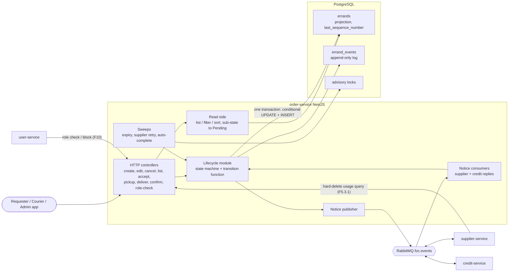
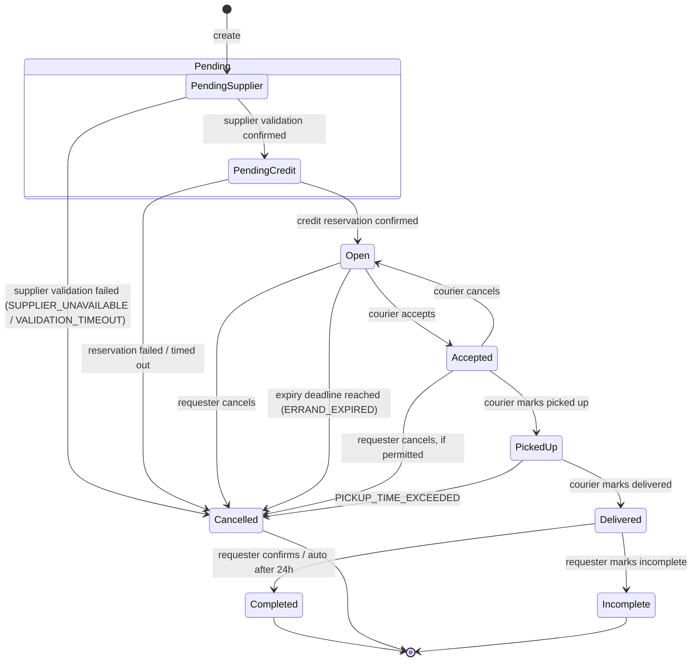
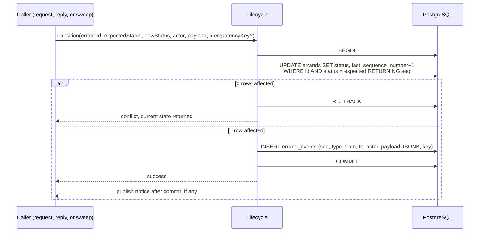
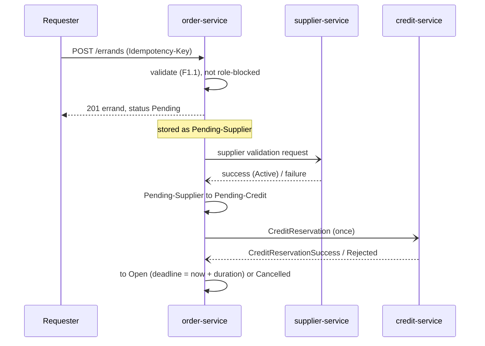

# order-service architecture

Diagrams are Mermaid (render on GitHub / VS Code). Decisions behind them: ADRs [0001](../docs/adr/order-service/0001-hand-rolled-event-sourcing-on-postgres.md)–[0005](../docs/adr/order-service/0005-errand-event-record-shape.md). Terms: [`CONTEXT.md`](./CONTEXT.md).

## 1. Components

Only the Lifecycle module writes. Every write, from a request, a notice reply or a sweep, goes through the same transition function.

## 2. State model (final, F9.4)

Final state transitions (F9.4). Terminal states: Completed, Cancelled, Incomplete. There is no Expired state.
1) Pending Supplier -> Pending-Credit (supplier validation  confirmed)	
2) Pending Supplier -> Cancelled (supplier validation failed)	
3) Pending Credit -> Open (credit reservation confirmed)	
4) Pending Credit -> Cancelled (credit reservation failed)	
5) Open -> Accepted  (courier accepts the errand)	
6) Open -> Cancelled (see F, requester cancels before acceptance)	
7) Open -> Cancelled with reason ERRAND_EXPIRED (see F, expiry time reached)	
8) Accepted -> Picked Up (see F, courier marks picked up)	
9) Accepted -> Open (see F, courier cancels after accepting, before pickup)	
10) Accepted -> Cancelled (see F requester cancels after acceptance, before pickup, if permitted)	
11) Picked Up -> Delivered (see F, courier marks delivered)	
12) Picked Up -> Cancelled	
13) Delivered -> Completed (requester confirms delivery, or auto-complete after 24h)	
14) Delivered -> Incomplete (requestor marks delivery as incomplete)

## 3. The write path (all transitions)

Concurrent accepts, late credit replies and sweep ticks all lose safely at the `WHERE status = expected` check. No Redis or RabbitMQ is involved in the race.

## 4. Create errand (the longest flow)

Creation never blocks on the supplier or credit outcome (F1.4.2). If Supplier Service is unreachable the errand stays in `Pending-Supplier` and the retry sweep picks it up.

