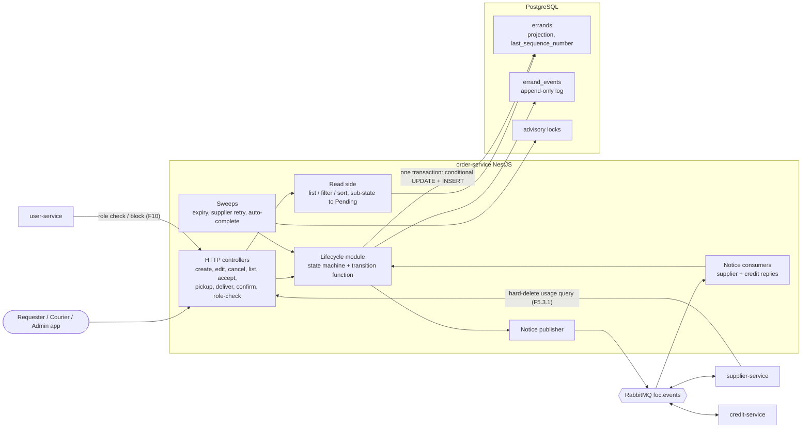
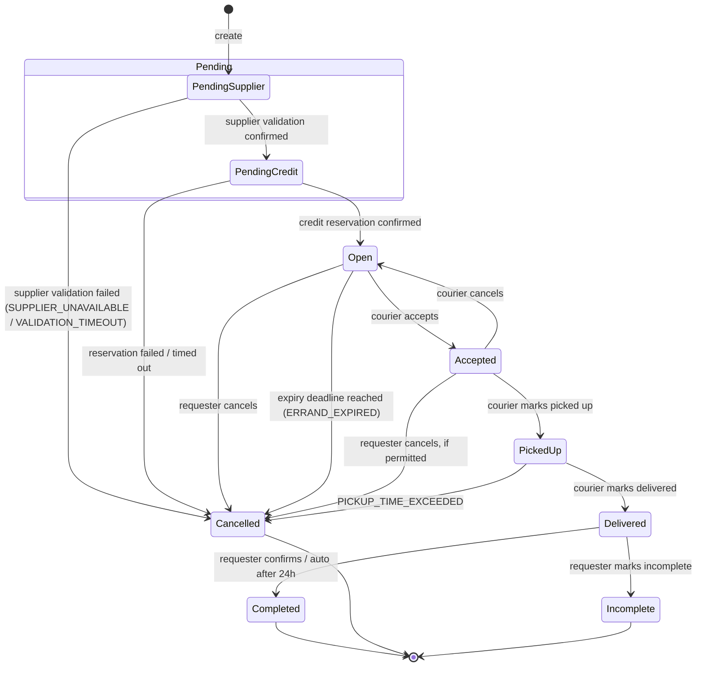
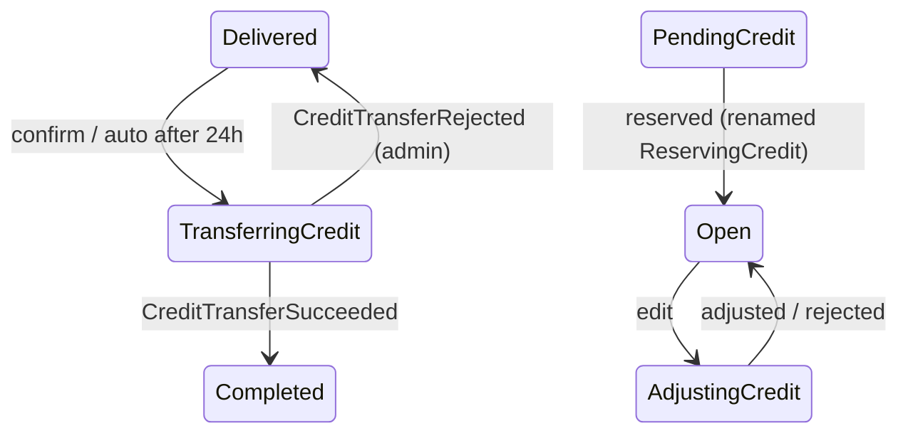
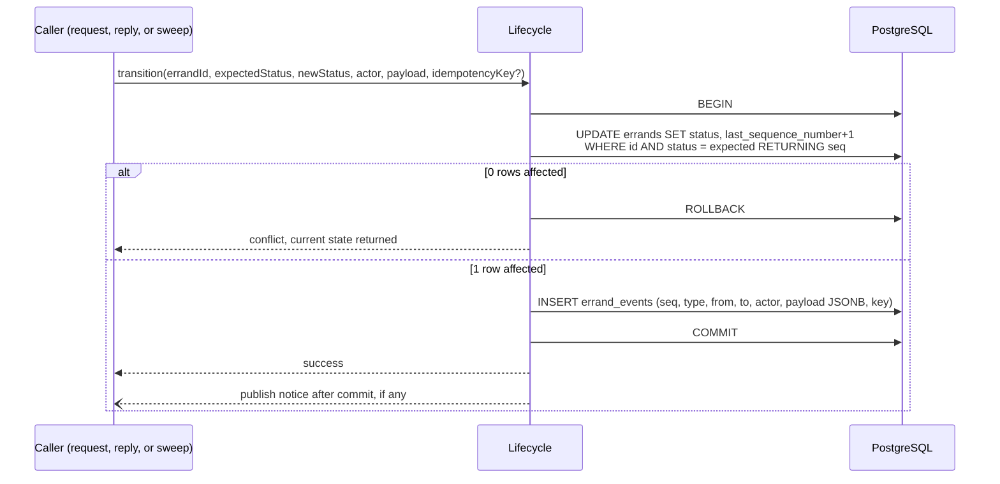
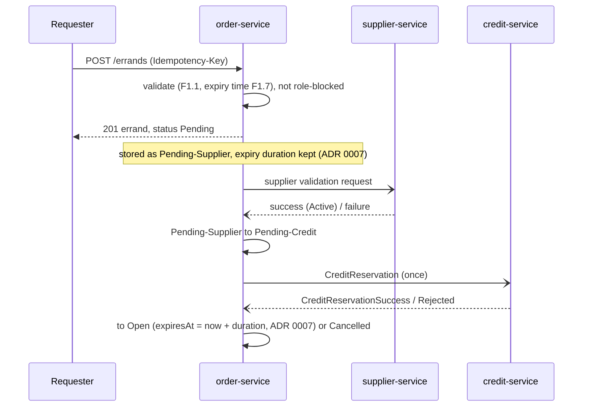

# order-service architecture

Diagrams are Mermaid (render on GitHub / VS Code). Decisions behind them: ADRs [0001](../docs/adr/order-service/0001-hand-rolled-event-sourcing-on-postgres.md)–[0007](../docs/adr/order-service/0007-expiry-duration-autocomplete-and-supplier-validation.md). Terms: [`CONTEXT.md`](./CONTEXT.md).

## 1. Components

```mermaid
flowchart LR
  Client([Requester / Courier / Admin app])
  User[user-service]
  Supplier[supplier-service]
  Credit[credit-service]

  subgraph OS[order-service NestJS]
    API[HTTP controllers<br/>create, edit, cancel, list, accept,<br/>pickup, deliver, confirm, role-check]
    Life[Lifecycle module<br/>state machine + transition function]
    Read[Read side<br/>list / filter / sort, sub-state to Pending]
    Consumers[Notice consumers<br/>supplier + credit replies]
    Pub[Notice publisher]
    Sweeps[Sweeps<br/>expiry, supplier retry, auto-complete]
  end

  subgraph PG[PostgreSQL]
    Errands[errands<br/>projection, last_sequence_number]
    Events[errand_events<br/>append-only log]
    Locks[advisory locks]
  end

  MQ{{RabbitMQ foc.events}}

  Client --> API
  User -- "role check / block (F10)" --> API
  Supplier -- "hard-delete usage query (F5.3.1)" --> API
  API --> Life
  API --> Read
  Read --> Errands
  Life -->|"one transaction: conditional UPDATE + INSERT"| Errands
  Life --> Events
  Sweeps --> Locks
  Sweeps --> Life
  Life --> Pub
  Pub --> MQ
  MQ --> Consumers
  Consumers --> Life
  MQ <--> Supplier
  MQ <--> Credit
```

Only the Lifecycle module writes. Every write, from a request, a notice reply or a sweep, goes through the same transition function.

## 2. State model (final, F9.4)

Final state transitions (F9.4). Terminal states: Completed, Cancelled, Incomplete. There is no Expired state.
1) Pending Supplier -> Pending-Credit (supplier validation  confirmed)	
2) Pending Supplier -> Cancelled (supplier validation failed)	
3) Pending Credit -> Open (credit reservation confirmed)	
4) Pending Credit -> Cancelled (credit reservation failed)	
5) Open -> Accepted  (courier accepts the errand)	
6) Open -> Cancelled (see F, requester cancels before acceptance)	
7) Open -> Cancelled with reason ERRAND_EXPIRED (see F, expiry time reached)	
8) Accepted -> Picked Up (see F, courier marks picked up)	
9) Accepted -> Open (see F, courier cancels after accepting, before pickup)	
10) Accepted -> Cancelled (see F requester cancels after acceptance, before pickup, if permitted)	
11) Picked Up -> Delivered (see F, courier marks delivered)	
12) Picked Up -> Cancelled	
13) Delivered -> Completed (requester confirms delivery, or auto-complete after 24h)	
14) Delivered -> Incomplete (requestor marks delivery as incomplete)

```mermaid
stateDiagram-v2
  [*] --> PendingSupplier: create
  state Pending {
    PendingSupplier --> PendingCredit: supplier validation confirmed
    PendingCredit
  }
  PendingSupplier --> Cancelled: supplier validation failed (SUPPLIER_UNAVAILABLE / VALIDATION_TIMEOUT)
  PendingCredit --> Open: credit reservation confirmed
  PendingCredit --> Cancelled: reservation failed / timed out
  Open --> Accepted: courier accepts
  Open --> Cancelled: requester cancels
  Open --> Cancelled: expiry deadline reached (ERRAND_EXPIRED)
  Accepted --> PickedUp: courier marks picked up
  Accepted --> Open: courier cancels
  Accepted --> Cancelled: requester cancels, if permitted
  PickedUp --> Delivered: courier marks delivered
  PickedUp --> Cancelled: PICKUP_TIME_EXCEEDED
  Delivered --> Completed: requester confirms / auto after 24h
  Delivered --> Incomplete: requester marks incomplete
  Completed --> [*]
  Cancelled --> [*]
  Incomplete --> [*]
```

### Planned: credit in-flight statuses (ADR 0006)

Decided but not yet in `status.ts` / `edges.ts`. The model above is what the code implements today; when this lands, §2 and the diagram change together with `ALLOWED`, `EDGES` and `status.spec.ts` (13 edges become 18). Status names are working names.

- `Pending-Credit` becomes `Reserving-Credit` (still shown as `Pending`).
- `Delivered -> Completed` becomes `Delivered -> Transferring-Credit -> Completed`. On an explicit `CreditTransferRejected` it returns to `Delivered` and goes to an admin; the auto-complete sweep skips it. Shown as `Completed`.
- Edit of an `Open` errand goes `Open -> Adjusting-Credit -> Open` (new amount on success, unchanged on rejection). Shown as `Open`.
- Cancelling (requester cancel, expiry, `PICKUP_TIME_EXCEEDED`, `Accepted` cancel) stays a direct edge to `Cancelled`; the release notice is fire-and-forget.
- A reply timeout never reverts: re-send, then leave in the in-flight status and alert an admin.

```mermaid
stateDiagram-v2
  Delivered --> TransferringCredit: confirm / auto after 24h
  TransferringCredit --> Completed: CreditTransferSucceeded
  TransferringCredit --> Delivered: CreditTransferRejected (admin)
  Open --> AdjustingCredit: edit
  AdjustingCredit --> Open: adjusted / rejected
  PendingCredit --> Open: reserved (renamed ReservingCredit)
```

## 3. The write path (all transitions)

```mermaid
sequenceDiagram
  participant C as Caller (request, reply, or sweep)
  participant L as Lifecycle
  participant DB as PostgreSQL
  C->>L: transition(errandId, expectedStatus, newStatus, actor, payload, idempotencyKey?)
  L->>DB: BEGIN
  L->>DB: UPDATE errands SET status, last_sequence_number+1<br/>WHERE id AND status = expected RETURNING seq
  alt 0 rows affected
    L->>DB: ROLLBACK
    L-->>C: conflict, current state returned
  else 1 row affected
    L->>DB: INSERT errand_events (seq, type, from, to, actor, payload JSONB, key)
    L->>DB: COMMIT
    L-->>C: success
    L--)C: publish notice after commit, if any
  end
```

Publishing after commit can lose a notice if the process dies between commit and publish. The planned fix is to write the notice to an outbox table in the same transaction and relay it to the broker (as credit-service does, credit ADR 0003/0004); not yet recorded in an order-service ADR. See `order-messaging-feature-docs.md` (M3).

Concurrent accepts, late credit replies and sweep ticks all lose safely at the `WHERE status = expected` check. No Redis or RabbitMQ is involved in the race.

### Idempotent requests: the `replayed` flag

A successful result carries `replayed: true` when the request was an idempotent repeat: the change already happened, so nothing new was written and no new notice is published. The first, fresh application has no `replayed` field (it is absent, never `false`). Callers must treat `replayed: true` as success and skip any follow-up they would do after a fresh write. It is set in three cases:

| Case | Where | Returned |
|---|---|---|
| Transition repeated with the same `idempotencyKey` and same fingerprint (`expected\|to\|actor`) | `transition.ts`, key claim | The first outcome stored in `idempotency_keys`, plus `replayed: true` |
| Transition repeated with no key: the errand's latest event is this same edge by this same actor (F9.10, #349) | `transition.ts`, after a `WHERE status = expected` miss | `{ ok: true, sequenceNumber: <the existing event's>, replayed: true }` |
| Create repeated with the same requester and `idempotencyKey` | `create.ts` | `{ ok: true, errandId: <the original errand's>, replayed: true }` |

Not flagged as replays: a repeated key whose fingerprint differs returns `IDEMPOTENCY_KEY_REUSED`, and a repeated key whose first outcome was a rejection returns that same rejection verbatim (`ok: false`), because `replayed` only exists on success. See [ADR 0005](../docs/adr/order-service/0005-errand-event-record-shape.md) for why a key keeps one outcome for its lifetime.

## 4. Create errand (the longest flow)

```mermaid
sequenceDiagram
  participant R as Requester
  participant O as order-service
  participant S as supplier-service
  participant K as credit-service
  R->>O: POST /errands (Idempotency-Key)
  O->>O: validate (F1.1, expiry time F1.7), not role-blocked
  O-->>R: 201 errand, status Pending
  Note over O: stored as Pending-Supplier, expiry duration kept (ADR 0007)
  O-)S: supplier validation request
  S--)O: success (Active) / failure
  O->>O: Pending-Supplier to Pending-Credit
  O-)K: CreditReservation (once)
  K--)O: CreditReservationSuccess / Rejected
  O->>O: to Open (expiresAt = now + duration, ADR 0007) or Cancelled
```

The code today still takes an absolute `expiresAt` at creation; the diagram shows the decided behaviour (ADR 0007). Creation never blocks on the supplier or credit outcome (F1.4.2). If Supplier Service is unreachable the errand stays in `Pending-Supplier` and the retry sweep picks it up.

