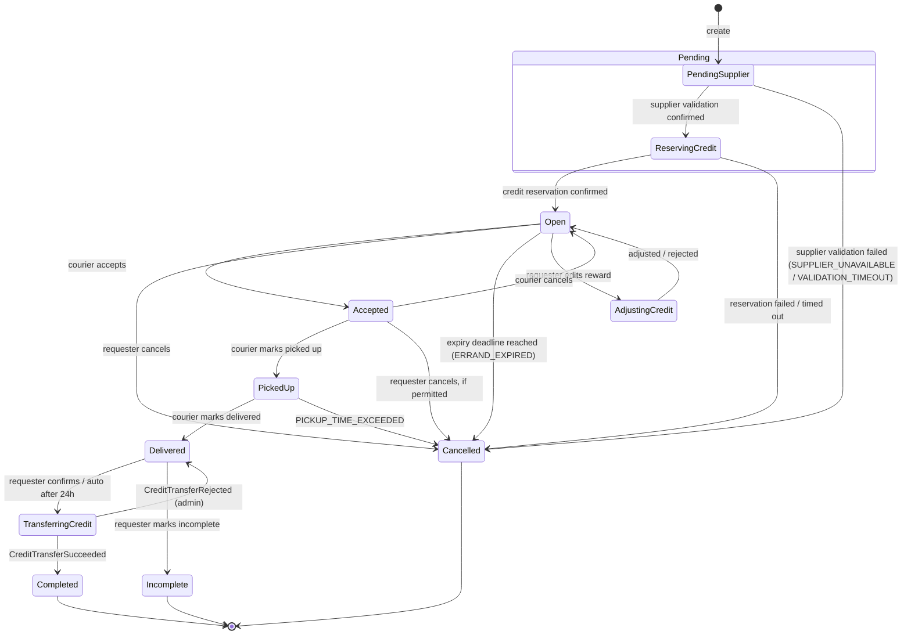
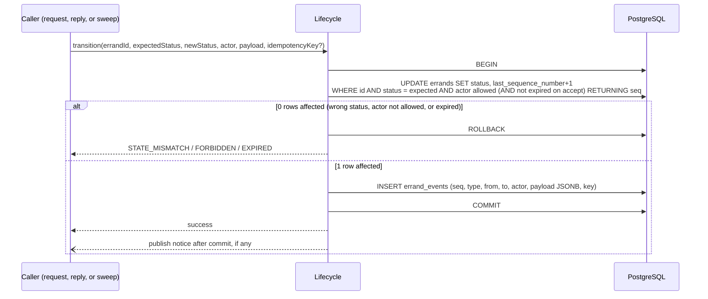

# order-service architecture

Diagrams are Mermaid (render on GitHub / VS Code). Decisions behind them: ADRs [0001](../docs/adr/order-service/0001-hand-rolled-event-sourcing-on-postgres.md)–[0007](../docs/adr/order-service/0007-expiry-duration-autocomplete-and-supplier-validation.md). Terms: [`CONTEXT.md`](./CONTEXT.md).

## 1. Components

```mermaid
flowchart LR
  Client([Requester / Courier / Admin app])
  User[user-service]
  Supplier[supplier-service]
  Credit[credit-service]

  subgraph OS[order-service NestJS]
    API[HTTP controllers<br/>create, edit, cancel, list, accept,<br/>pickup, deliver, confirm, role-check]
    Life[Lifecycle module<br/>state machine + transition function]
    Read[Read side<br/>list / filter / sort, sub-state to Pending]
    Consumers[Notice consumers<br/>supplier + credit replies]
    Pub[Notice publisher]
    Sweeps[Sweeps<br/>expiry, supplier retry, auto-complete]
  end

  subgraph PG[PostgreSQL]
    Errands[errands<br/>projection, last_sequence_number]
    Events[errand_events<br/>append-only log]
    Locks[advisory locks]
  end

  MQ{{RabbitMQ foc.events}}

  Client --> API
  User -- "role check / block (F10)" --> API
  Supplier -- "hard-delete usage query (F5.3.1)" --> API
  API --> Life
  API --> Read
  Read --> Errands
  Life -->|"one transaction: conditional UPDATE + INSERT"| Errands
  Life --> Events
  Sweeps --> Locks
  Sweeps --> Life
  Life --> Pub
  Pub --> MQ
  MQ --> Consumers
  Consumers --> Life
  MQ <--> Supplier
  MQ <--> Credit
```

Only the Lifecycle module writes. Every write, from a request, a notice reply or a sweep, goes through the same transition function.

## 2. State model (F9.4, ADR 0006)

18 edges over 11 statuses. Terminal states: Completed, Cancelled, Incomplete. There is no Expired state. `Pending-Supplier`, `Reserving-Credit`, `Transferring-Credit` and `Adjusting-Credit` are internal; the read side shows `Pending-Supplier` / `Reserving-Credit` as `Pending`, `Transferring-Credit` as `Completed` and `Adjusting-Credit` as `Open`.
1) Pending-Supplier -> Reserving-Credit (supplier validation confirmed)
2) Pending-Supplier -> Cancelled (supplier validation failed)
3) Reserving-Credit -> Open (credit reservation confirmed)
4) Reserving-Credit -> Cancelled (credit reservation failed or timed out)
5) Open -> Accepted (courier accepts the errand)
6) Open -> Cancelled (requester cancels before acceptance, or ERRAND_EXPIRED when the expiry time is reached)
7) Open -> Adjusting-Credit (requester edits the reward, F2)
8) Adjusting-Credit -> Open, `CreditAdjusted` (adjustment confirmed, new `rewardCredits`)
9) Adjusting-Credit -> Open, `CreditAdjustmentFailed` (adjustment rejected, amount unchanged)
10) Accepted -> Picked Up (courier marks picked up)
11) Accepted -> Open (courier cancels after accepting, before pickup)
12) Accepted -> Cancelled (requester cancels after acceptance, before pickup, if permitted)
13) Picked Up -> Delivered (courier marks delivered)
14) Picked Up -> Cancelled (PICKUP_TIME_EXCEEDED, system only; the requester cannot cancel once picked up)
15) Delivered -> Transferring-Credit (requester confirms delivery, or auto-complete after 24h)
16) Transferring-Credit -> Completed (`CreditTransferSucceeded`)
17) Transferring-Credit -> Delivered (`CreditTransferRejected`; goes to an admin, the auto-complete sweep skips it)
18) Delivered -> Incomplete (requester marks delivery as incomplete)

18 edges over 17 distinct status pairs: the two `Adjusting-Credit` -> `Open` exits (items 8 and 9) share a pair, so a caller picks between them with `TransitionInput.type`.

### Who may take an edge, and guards

Each edge in `edges.ts` lists the actors allowed to take it (`who`); the check is part of the conditional UPDATE, so it is race-safe. The actor is a required tagged value (`{ kind: 'user', id }` or `SYSTEM`); a missing or malformed actor is `INVALID_FIELDS`, never the system. Only reply consumers and sweeps build `SYSTEM`. It is stored as a null `actor_id`.

| Edge(s) | Allowed actors |
| --- | --- |
| 1, 2, 3, 4, 8, 9, 16, 17 (supplier and credit replies, timeouts) | system |
| 5 `Open` -> `Accepted` | any user except the requester; `courierId` must be the actor |
| 6 `Open` -> `Cancelled` | requester (`REQUESTER_CANCELLED`) or system (`ERRAND_EXPIRED`); a user reason needs a user actor, every other reason the system |
| 12 `Accepted` -> `Cancelled` | requester (`REQUESTER_CANCELLED`); the courier withdraws via edge 11 instead |
| 14 `Picked Up` -> `Cancelled` | system only |
| 7 edit, 18 incomplete | requester |
| 10, 11, 13 (pick up, withdraw, deliver) | the errand's courier |
| 15 confirm | requester or system (24h auto-complete) |

Further guards: a courier may hold one active errand (`Accepted` or `Picked Up`), enforced by a partial unique index (`COURIER_BUSY`); item 5 is refused once `expires_at` has passed (`EXPIRED`), a backstop only: it rejects the accept but does not cancel, and the expiry sweep is what moves the errand `Open` → `Cancelled` (`ERRAND_EXPIRED`); a cancel's `cancellationReason` must be in that edge's subset of `CANCELLATION_REASONS` (`INVALID_FIELDS`). A refused actor gets `FORBIDDEN`.

Cancelling (requester cancel, expiry, `PICKUP_TIME_EXCEEDED`, `Accepted` cancel) is a direct edge to `Cancelled`; the release notice to credit is fire-and-forget. A reply timeout never reverts: re-send, then leave the errand in its in-flight status and alert an admin.

```mermaid
stateDiagram-v2
  [*] --> PendingSupplier: create
  state Pending {
    PendingSupplier --> ReservingCredit: supplier validation confirmed
    ReservingCredit
  }
  PendingSupplier --> Cancelled: supplier validation failed (SUPPLIER_UNAVAILABLE / VALIDATION_TIMEOUT)
  ReservingCredit --> Open: credit reservation confirmed
  ReservingCredit --> Cancelled: reservation failed / timed out
  Open --> Accepted: courier accepts
  Open --> Cancelled: requester cancels
  Open --> Cancelled: expiry deadline reached (ERRAND_EXPIRED)
  Open --> AdjustingCredit: requester edits reward
  AdjustingCredit --> Open: adjusted / rejected
  Accepted --> PickedUp: courier marks picked up
  Accepted --> Open: courier cancels
  Accepted --> Cancelled: requester cancels, if permitted
  PickedUp --> Delivered: courier marks delivered
  PickedUp --> Cancelled: PICKUP_TIME_EXCEEDED
  Delivered --> TransferringCredit: requester confirms / auto after 24h
  TransferringCredit --> Completed: CreditTransferSucceeded
  TransferringCredit --> Delivered: CreditTransferRejected (admin)
  Delivered --> Incomplete: requester marks incomplete
  Completed --> [*]
  Cancelled --> [*]
  Incomplete --> [*]
```

## 3. The write path (all transitions)

```mermaid
sequenceDiagram
  participant C as Caller (request, reply, or sweep)
  participant L as Lifecycle
  participant DB as PostgreSQL
  C->>L: transition(errandId, expectedStatus, newStatus, actor, payload, idempotencyKey?)
  L->>DB: BEGIN
  L->>DB: UPDATE errands SET status, last_sequence_number+1<br/>WHERE id AND status = expected AND actor allowed (AND not expired on accept) RETURNING seq
  alt 0 rows affected (wrong status, actor not allowed, or expired)
    L->>DB: ROLLBACK
    L-->>C: STATE_MISMATCH / FORBIDDEN / EXPIRED
  else 1 row affected
    L->>DB: INSERT errand_events (seq, type, from, to, actor, payload JSONB, key)
    L->>DB: COMMIT
    L-->>C: success
    L--)C: publish notice after commit, if any
  end
```

Publishing after commit can lose a notice if the process dies between commit and publish. The planned fix is to write the notice to an outbox table in the same transaction and relay it to the broker (as credit-service does, credit ADR 0003/0004); not yet recorded in an order-service ADR. See `order-messaging-feature-docs.md` (M3).

Concurrent accepts, late credit replies and sweep ticks all lose safely at the `WHERE status = expected` check. No Redis or RabbitMQ is involved in the race.

### Idempotent requests: the `replayed` flag

A successful result carries `replayed: true` when the request was an idempotent repeat: the change already happened, so nothing new was written and no new notice is published. The first, fresh application has no `replayed` field (it is absent, never `false`). Callers must treat `replayed: true` as success and skip any follow-up they would do after a fresh write. It is set in three cases:

| Case | Where | Returned |
|---|---|---|
| Transition repeated with the same `idempotencyKey` and same fingerprint (`expected\|to\|actor\|type\|hash(set, payload)`; server-stamped timestamps excluded) | `transition.ts`, key claim | The first outcome stored in `idempotency_keys`, plus `replayed: true` |
| Transition repeated with no key: the errand's latest event is this same edge by this same actor (F9.10, #349) | `transition.ts`, after a `WHERE status = expected` miss | `{ ok: true, sequenceNumber: <the existing event's>, replayed: true }` |
| Create repeated with the same requester and `idempotencyKey` | `create.ts` | `{ ok: true, errandId: <the original errand's>, replayed: true }` |

Not flagged as replays: a repeated key whose fingerprint differs returns `IDEMPOTENCY_KEY_REUSED`, and a repeated key whose first outcome was a rejection returns that same rejection verbatim (`ok: false`), because `replayed` only exists on success. See [ADR 0005](../docs/adr/order-service/0005-errand-event-record-shape.md) for why a key keeps one outcome for its lifetime.

## 4. Create errand (the longest flow)

```mermaid
sequenceDiagram
  participant R as Requester
  participant O as order-service
  participant S as supplier-service
  participant K as credit-service
  R->>O: POST /errands (Idempotency-Key)
  O->>O: validate (F1.1, expiry time F1.7), not role-blocked
  O-->>R: 201 errand, status Pending
  Note over O: stored as Pending-Supplier, expiry duration kept (ADR 0007)
  O-)S: supplier validation request
  S--)O: success (Active) / failure
  O->>O: Pending-Supplier to Reserving-Credit
  O-)K: CreditReservation (once)
  K--)O: CreditReservationSuccess / Rejected
  O->>O: to Open (expiresAt = now + duration, ADR 0007) or Cancelled
```

The code today still takes an absolute `expiresAt` at creation; the diagram shows the decided behaviour (ADR 0007). Creation never blocks on the supplier or credit outcome (F1.4.2). If Supplier Service is unreachable the errand stays in `Pending-Supplier` and the retry sweep picks it up.

