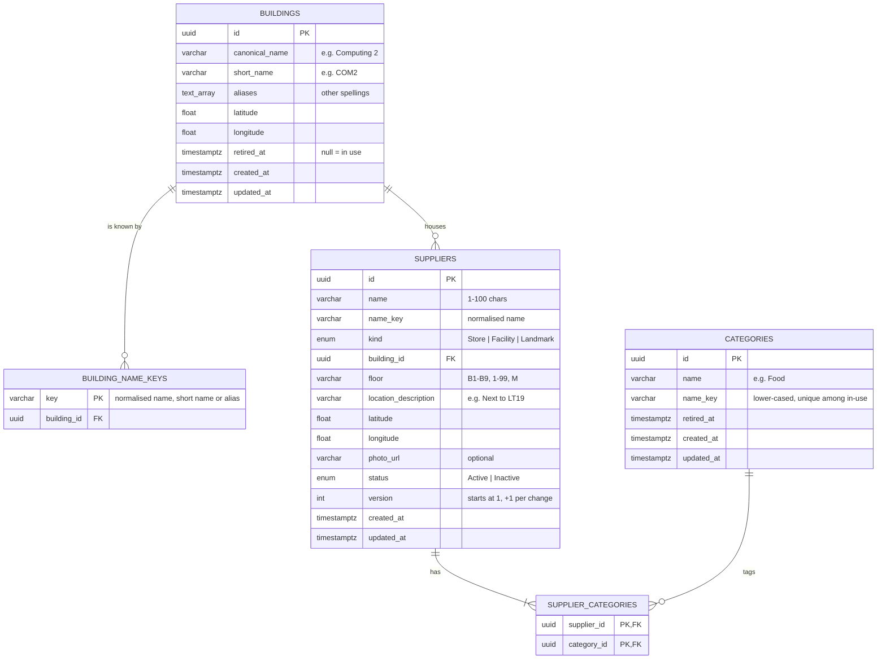
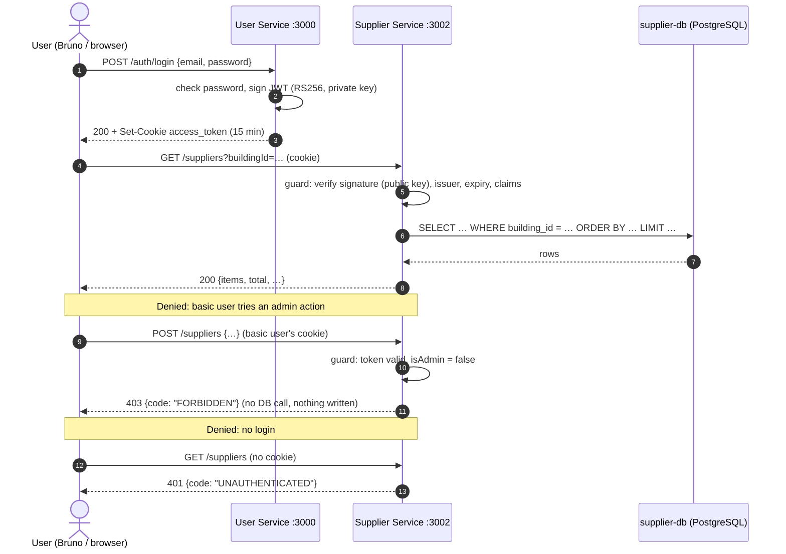
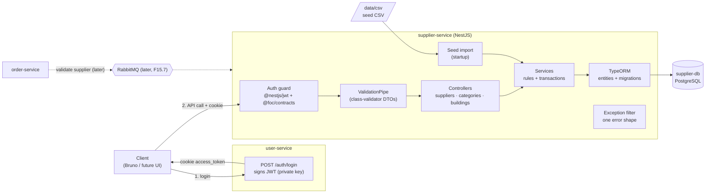

# Supplier Service (M.2)

The Supplier Service is FoC's source of truth for **suppliers**: the physical places on campus where errand items are picked up (a shop, a facility such as a printer, or a landmark). A supplier is a **pickup point, not a shop front**. There are no menus, products, stock or prices; those are out of scope in the project brief.

Other services use it like this:
- **Users** browse and search suppliers when creating an errand.
- **Admins** add, edit and deactivate suppliers, and manage categories and buildings.
- **Order Service** checks a supplier's current details and status when an errand references it.

> **Status key:** ✅ built · 🔜 planned (step N, see [Build plan](#8-build-plan)).
> This README describes the design for the D2 milestone. Anything marked 🔜 is designed but not yet built.

**Contents**

1. [Scope for D2](#1-scope-for-d2)
2. [Tech stack, compared with the other services](#2-tech-stack-compared-with-the-other-services)
3. [D2 point 1: Database choice and schema](#3-d2-point-1-database-choice-and-schema)
4. [D2 point 2: Query patterns and API](#4-d2-point-2-query-patterns-and-api)
5. [D2 points 2 and 4: Identity and roles from User Service](#5-d2-points-2-and-4-identity-and-roles-from-user-service)
6. [D2 point 3: CRUD without a UI](#6-d2-point-3-crud-without-a-ui)
7. [D2 point 4: End-to-end demo script](#7-d2-point-4-end-to-end-demo-script)
8. [Build plan](#8-build-plan)
9. [Dependencies and risks](#9-dependencies-and-risks)
10. [Likely examiner questions](#10-likely-examiner-questions)
11. [Running and testing](#11-running-and-testing)

---

## 1. Scope for D2

D2 asks for Supplier Service **"significant progress"**: Part 2 points 1-4 of the D2 instructions. There is **no UI** for D2; point 5 (a responsive UI) comes later.

| D2 point | What we show | Requirements (FR v2) |
|---|---|---|
| 1. DB choice + schema + metadata | PostgreSQL, the five tables, how name, type and location are stored and queried | F1, F4, F11, F12 |
| 2. Query patterns + API + identity/roles | List, search, filter, sort, paginate and get-one through working API calls; how the user-service login is checked; what a denied request looks like | F5, F15.1-F15.5, F13 |
| 3. CRUD through the API alone | Create, read, update, and "delete" (= set Inactive) with no UI running | F7.5, F8.6, F9, F14.1, F14.3 |
| 4. Authenticated user → API → DB, roles differ | A basic user and an admin run the same calls and get different answers | F13 + demo accounts + API collection |

**Not in D2** (designed, built later):
- **moderation:** basic users *request* changes and admins approve (F6-F9.4)
- opening hours (F2)
- brands (F3)
- Order validation over RabbitMQ (F15.7)
- safe retries, audit log and rate limits (F14.2, F14.4, F16)
- images (F17)
- hard delete (F10)

---

## 2. Tech stack, compared with the other services

Consistency with the rest of the team comes first. New libraries need a stated reason.

| Concern | Supplier Service | Same as | Notes |
|---|---|---|---|
| Framework | NestJS 12, TypeScript, ES modules ✅ | user-service, credit-service, order-service | |
| Database | PostgreSQL 18 (`postgres:18-alpine`), own container `supplier-db` ✅ | user-service, credit-service, order-service | One database per service |
| Talking to the DB | TypeORM ✅ | user-service, credit-service | order-service's open PR uses Drizzle instead |
| Creating tables | TypeORM **migration files**, applied on startup; `synchronize` is always off ✅ | credit-service (PR #592) | user-service uses `synchronize` |
| Config checks at startup | Joi schema; the app refuses to start on bad settings ✅ | user-service | |
| Request validation | class-validator DTOs through one global `ValidationPipe` ✅ | user-service | **Difference:** we *reject* unknown fields instead of silently dropping them (F1.6, F1.3.2) |
| Error format | One JSON shape for every error ✅ | none (others use Nest defaults) | Needed by F1.6.1, F14.1.1, F15.3; extends Nest's default fields |
| Login check | `@nestjs/jwt` (RS256, public key only) + `@foc/contracts` 🔜 step 2 | user-service signs with `@nestjs/jwt`; `@foc/contracts` is shared | No token code is copied |
| Tests | vitest (unit + e2e), supertest ✅ | user-service | DB-backed e2e uses a throwaway Postgres, like credit-service |
| Lint | oxlint (type-aware) ✅ | user-service | |
| Docker | Multi-stage Dockerfile, `compose.yml` included from the root `compose.yaml` ✅ | order-service scaffold (9253390) | Build context moves to the repo root in step 2, as user-service does, so `@foc/contracts` can be built |

---

## 3. D2 point 1: Database choice and schema

### Why PostgreSQL
- **The data is structured and fixed.** Every supplier has the same fields: name, kind, building, floor, location, coordinates and status. There are no free-form documents.
- **It is relational.** Suppliers *reference* buildings and categories, and a supplier can have several categories. The database must refuse a reference to something that doesn't exist.
- **The database enforces the rules, not only the code.** Two admins submitting the same supplier at the same moment must not both succeed (F1.5.2). A unique constraint in the database guarantees that, and a code check alone can't.
- **Transactions.** Every write is all-or-nothing (F14.1).
- **The queries are filter + sort + paginate**, which SQL and indexes do well. Search is by name, building, category, kind and status, with stable page boundaries.
- **The scale is small.** There are a few hundred suppliers on one campus, so one Postgres instance is plenty. Reads dominate, and more service replicas can share the same database.
- **The team already runs it.** user-service and credit-service use PostgreSQL, so we reuse the same image, tooling and knowledge.

**Database per service:** Supplier Service owns `supplier-db` and no other service reads it. Other services ask through the API (and, later, RabbitMQ). This keeps each service's tables private, so they can change without breaking anyone.

### Schema (🔜 step 3)



| Table | Purpose | Rules the database enforces |
|---|---|---|
| `suppliers` | One row per pickup point | `UNIQUE (name_key, building_id, floor)` blocks duplicates, even when two requests race (F1.5, F1.5.2). CHECKs on name length, floor format, non-blank location and coordinate ranges. `building_id` must exist. |
| `buildings` | The controlled list of campus buildings (F4) | Coordinate range CHECKs |
| `building_name_keys` | Every name, short name and alias of each in-use building, normalised | The primary key makes two in-use buildings sharing a name impossible (F4.2). Looking up a building by any name is one key lookup (F4.5). |
| `categories` | The controlled list of categories (F11) | Partial unique index on `name_key` among non-retired categories (F11.2.1) |
| `supplier_categories` | Which categories each supplier has (many-to-many) | The primary key stops the same category being added twice (F1.2.3). A category in use can't be removed. |

Rules the database **can't** express are checked in the service, inside the same transaction:
- **"at least one category"** (F1.2.3)
- **"coordinates inside the NUS campus box"** (F1.2.7): the box comes from configuration, which a DB CHECK can't read
- **"only non-retired buildings and categories for new values"** (F1.8)

**System-managed fields** (`id`, `status`, `version`, `created_at`, `updated_at`) are set only by the server. A request that tries to set one is rejected (F1.3, F1.3.2).

**Retire, don't delete:** buildings and categories are *retired* (`retired_at` is set), never deleted. Suppliers that already use them keep working, but they can't be chosen for new data (F1.8, F4.3.1, F11.3).

### How the D2 metadata is stored and queried

| Metadata | Stored as | Queried by |
|---|---|---|
| **Name** | `name` as typed, plus `name_key`: trimmed, spaces collapsed, lower-cased and Unicode-normalised (F1.5) | Case-insensitive partial match on `name_key` (F5.4.1). The same key drives duplicate detection. |
| **Type** | `kind` (Store / Facility / Landmark, one per supplier) **and** categories (Food, Coffee…, one or more, via `supplier_categories`) | `?kind=` and `?categoryId=`, each accepting several values |
| **Location** | building (reference) + floor + a short "how to find it" description + map coordinates | `?buildingId=`. "Near me" coordinate search isn't in the FRs; see [§10](#10-likely-examiner-questions). |
| **Display name** | Not stored; derived as `"<Name> @ <Building short name>"`, e.g. `Cool Spot @ COM3` (F1.4) | Default sort key (F5.3) |

### Seed data (🔜 step 4)
- **Source:** `data/csv/supplier-seed-data.csv`, 21 rows. Columns: Name, Type, Building, Floor, Location Description, Latitude, Longitude, StartingTime, ClosingTime, ImageURL.
- **Loaded on startup,** and safe to run again: rows already present are skipped, keyed by the duplicate rule (F12.1).
- **Buildings** are matched by name or alias, and the initial building list includes every spelling in the file (F12.2.1).
- **"Food/Coffee"** becomes two categories (F12.2.2).
- **Bad characters** from Windows-1252 encoding are repaired (F12.3).
- **A bad row** is skipped and logged with its row number and reason; it never stops the import (F12.4).
- **Opening hours** in the file are ignored until step 13.

---

## 4. D2 point 2: Query patterns and API

All endpoints are 🔜 (steps 5-6) except `/health` ✅.

**How to call it:**
- base URL `http://localhost:3002`
- JSON in and out
- the login cookie `access_token` comes from user-service; see [§5](#5-d2-points-2-and-4-identity-and-roles-from-user-service)

### Query patterns

| Pattern | Call | FR |
|---|---|---|
| Get one supplier by id | `GET /suppliers/{id}` | F5.9 |
| Search by name (partial, any case) | `GET /suppliers?name=cool` | F5.4.1 |
| By location (building) | `GET /suppliers?buildingId={id}` (repeatable) | F5.4.3 |
| By category | `GET /suppliers?categoryId={id}` (repeatable; matches any) | F5.4.2 |
| By kind | `GET /suppliers?kind=Store` (repeatable) | F5.4.4 |
| By status | `GET /suppliers?status=Active` (default: both) | F5.4.5, F5.7 |
| Combined | `GET /suppliers?categoryId={food}&buildingId={com3}&status=Active`: filters are ANDed | F5.5 |
| Sort | Default: display name A→Z, then id. Or `?sort=name\|building\|createdAt\|updatedAt&order=asc\|desc`, always ending with id as the tie-breaker | F5.3, F5.3.1 |
| Pages | `?offset=0&limit=25` (max 1000) | F5.2, N3.1 |

**Behaviour:**
- **No match** returns `200` with an empty list and `total: 0`, not a 404 (F5.6).
- **An unknown query parameter,** or a category or building id that doesn't exist, returns `400`, not silently ignored (F5.8).
- **Filtering by a retired category or building** returns an empty list (F5.8.1).

**List response:**
```json
{
  "items": [
    {
      "id": "7c9e…",
      "displayName": "Cool Spot @ COM3",
      "name": "Cool Spot",
      "brand": null,
      "kind": "Store",
      "categories": [{ "id": "…", "name": "Food" }],
      "building": { "id": "…", "shortName": "COM3" },
      "floor": "1",
      "status": "Active",
      "isOpenNow": null,
      "thumbnailUrl": "https://…/placeholder.png"
    }
  ],
  "total": 21,
  "offset": 0,
  "limit": 25,
  "hasMore": false
}
```
- `brand` stays `null` until brands (step 14).
- `isOpenNow` stays `null` ("not applicable", F2.5.1) until opening hours (step 13).
- With no photo, a placeholder image URL is returned (F1.2.9).

**Single supplier (`GET /suppliers/{id}`)** returns every list field plus:
- `building.canonicalName`, `locationDescription`, `coordinates {latitude, longitude}`
- `openingHours`, `nextChangeAt` (null for now)
- image URLs
- `version`, `createdAt`, `updatedAt`

It also returns the version in an `ETag` header. This response is also what other services rely on: it has enough detail for them to keep their own copy (F15.1). The endpoint is read-only, so it is safe to retry (F15.4).

### Endpoints

| Method | Path | Who | What | FR |
|---|---|---|---|---|
| GET | `/health` | anyone, no login | Is the service up? ✅ | |
| GET | `/suppliers` | any logged-in user | List / search / filter / sort / paginate | F5 |
| GET | `/suppliers/{id}` | any logged-in user | One supplier in full | F5.9, F15.1 |
| POST | `/suppliers` | **admin** | Create (starts Active) | F7.5, F9.1 |
| PATCH | `/suppliers/{id}` | **admin** | Edit some fields; needs `If-Match` | F8.6, F14.3 |
| PUT | `/suppliers/{id}/status` | **admin** | Set Active / Inactive; needs `If-Match` | F9.2, F9.5 |
| GET | `/categories` | any logged-in user | In-use categories | F11.4 |
| POST | `/categories` | **admin** | Create a category | F11.2 |
| PATCH | `/categories/{id}` | **admin** | Rename | F11.2 |
| POST | `/categories/{id}/retire` | **admin** | Retire | F11.3 |
| GET | `/buildings` | any logged-in user | In-use buildings with names and coordinates | F4.4 |
| POST | `/buildings` | **admin** | Create a building | F4.3 |
| PATCH | `/buildings/{id}` | **admin** | Rename or change aliases | F4.3 |
| POST | `/buildings/{id}/retire` | **admin** | Retire | F4.3.1 |

`retire` is a `POST` action rather than `DELETE`, so it can't be confused with deleting data.

### Errors
Every error, from any endpoint, has one shape (✅ built in `src/common/errors/`):

```json
{
  "statusCode": 400,
  "error": "Bad Request",
  "message": "Request validation failed.",
  "code": "VALIDATION_FAILED",
  "violations": [
    { "field": "floor", "reason": "floor must be B1-B9, 1-99 or M" },
    { "field": "name", "reason": "name must be 1-100 characters" }
  ]
}
```

- `code` is for programs; `message` is for people.
- `violations` lists **every** bad field at once (F1.6.1).
- `retryable: true` marks a temporary failure. It comes with a `Retry-After` header.

| Status | `code` | When |
|---|---|---|
| 400 | `VALIDATION_FAILED` ✅ | Bad or unknown fields or query parameters |
| 401 | `UNAUTHENTICATED` ✅ | No login cookie, or the token is invalid or expired |
| 403 | `FORBIDDEN` ✅ | Logged in, but not an admin, on an admin endpoint |
| 404 | `NOT_FOUND` ✅ / `SUPPLIER_NOT_FOUND` 🔜 | Unknown id (F5.9.1) |
| 409 | `DUPLICATE_SUPPLIER`, `DUPLICATE_NAME`, `VERSION_CONFLICT`, `INVALID_STATUS_TRANSITION` 🔜 | Same name+building+floor exists; the name is taken; someone else edited first (includes `currentVersion`); already in that status |
| 413 | `PAYLOAD_TOO_LARGE` ✅ | Request body too big |
| 428 | `PRECONDITION_REQUIRED` ✅ | An edit sent without `If-Match` |
| 503 | `DEPENDENCY_UNAVAILABLE` ✅ (`retryable: true`) | The database can't be reached. Never reported as "not found" (F15.3). |
| 500 | `INTERNAL_ERROR` ✅ | Unexpected. Details are logged, never sent to the client. |

---

## 5. D2 points 2 and 4: Identity and roles from User Service

🔜 step 2. The token format is the team's shared contract in `packages/contracts` (`@foc/contracts`).

**How it works:**
1. The user logs in at user-service: `POST localhost:3000/auth/login`.
2. user-service sets an httpOnly cookie `access_token`: a JWT signed with **RS256** using user-service's **private** key. It has issuer `user-service` and lasts 15 minutes.
3. The browser (or Bruno) sends that cookie to `localhost:3002` too, because cookies are matched by host, not port.
4. Supplier Service **verifies the token itself** with user-service's **public** key, mounted as a Docker secret (`JWT_PUBLIC_KEY_FILE`). No call to user-service is needed per request, and the private key never leaves user-service.
5. It then checks the token's contents with `validateAccessTokenPayload` from `@foc/contracts`. The claims are `sub` (user id), `email`, `displayName`, `isAdmin`, `roles`, `iss`, `iat` and `exp`.
6. **Admin = `isAdmin: true` in the token.** `roles` (requester/courier) are errand roles and don't change supplier permissions. The FRs only distinguish Basic vs Admin (F13.3, F13.4).
7. Identity comes **only** from the verified token, never from the request body (F13.1).

**One global guard runs before anything else** (before validation and before the handler):
- no cookie, a bad signature, the wrong issuer, expired, or bad contents → **401** (F13.2)
- valid, but not an admin on an admin endpoint → **403**, and the handler never runs (F13.5)
- `/health` is the only endpoint marked public





**Stale claims trade-off:** a token can be up to 15 minutes old. If an admin is demoted, their token still says `isAdmin: true` until it expires. For D2 we trust the token and state the 15-minute window. The team's RBAC ADR (unmerged) suggests re-checking admin endpoints against user-service; that is a team decision.

---

## 6. D2 point 3: CRUD without a UI

🔜 step 6. Everything is done through the API; no UI is needed or running.

| CRUD | Call | Notes |
|---|---|---|
| **Create** | `POST /suppliers` | Admin. Full validation and duplicate check. Starts Active, version 1. |
| **Read** | `GET /suppliers`, `GET /suppliers/{id}` | Any logged-in user |
| **Update** | `PATCH /suppliers/{id}` with header `If-Match: "3"` | Admin. Only the fields sent change. The version goes up by 1. |
| **Delete (D2)** | `PUT /suppliers/{id}/status {"status":"Inactive"}` with `If-Match` | Admin. The supplier stays in the database, tagged Inactive, and can be re-activated. Errands already created are unaffected (F9.6). |

**Why "delete" means Inactive for D2:** permanent deletion (F10) has to check with Order Service that no errand ever used the supplier, and needs the admin to re-enter their password through User Service. Neither exists yet, so hard delete is scheduled last (step 21). Deactivating is also the everyday way to remove a supplier, because it keeps errand history intact.

**Lost-update protection (F14.3):**
- Every edit must say which version it was based on, using `If-Match`.
- If someone changed the supplier in the meantime, the edit is refused with **409** and the current version, instead of silently overwriting their change.
- Missing `If-Match` → **428**.

**All-or-nothing writes (F14.1):** each write runs in one database transaction. A failure saves nothing.

**How to run it:** a saved request collection (🔜 step 7, **Bruno**, in `supplier-service/api/`). Log in, then run each call in order.

---

## 7. D2 point 4: End-to-end demo script

🔜 step 7. Run with `docker compose up` from the repo root. Each step is a Bruno request.

| # | As | Call | Expected |
|---|---|---|---|
| 1 | nobody | `GET /suppliers` | **401** `UNAUTHENTICATED` |
| 2 | basic user | log in at user-service | cookie set |
| 3 | basic user | `GET /suppliers?name=cool` | **200**, matching suppliers |
| 4 | basic user | `GET /suppliers?buildingId={COM3}&sort=name` | **200**, COM3 suppliers A→Z |
| 5 | basic user | `GET /suppliers/{id}` | **200**, full details + `ETag` |
| 6 | basic user | `POST /suppliers {…}` | **403** `FORBIDDEN`, nothing written |
| 7 | admin | log in at user-service | cookie set |
| 8 | admin | `POST /suppliers {…}` | **201**, version 1 |
| 9 | admin | same `POST` again | **409** `DUPLICATE_SUPPLIER` |
| 10 | admin | `PATCH /suppliers/{id}` with `If-Match: "1"` | **200**, version 2 |
| 11 | admin | same `PATCH` with the old `If-Match: "1"` | **409** `VERSION_CONFLICT`, `currentVersion: 2` |
| 12 | admin | `PUT /suppliers/{id}/status {"status":"Inactive"}` | **200**, Inactive |
| 13 | basic user | `GET /suppliers?status=Active` | the deactivated supplier is gone from the list |

---

## 8. Build plan

Branches are few and large: one per area, each merged into `supplier-service` by one PR.

| Step | What | FRs | Branch | Status |
|---|---|---|---|---|
| 1 | Scaffold: app, config, DB wiring, migrations, Docker, error format | groundwork for F1.7, F14.1.1, F15.3 | `scaffold` | ✅ merged (#598) |
| 2 | Auth: check the user-service login token | F13.1-F13.5 | `auth` | 🔜 |
| 3 | Data model, categories, buildings (no endpoints yet) | F1.1, F1.2.1-F1.2.7, F1.2.9, F1.3-F1.8, F4.1, F4.2, F4.5, F11.1, F11.3 | `database` | 🔜 |
| 4 | Seed import | F12.1, F12.2.1, F12.2.2, F12.2.4-F12.2.6, F12.3, F12.4 | `database` | 🔜 |
| 5 | Read: list, filter, sort, get one; category/building lists | F5.1-F5.9.1 (not F5.4.6/F5.4.7), F15.1-F15.5, F4.4, F11.4 | `crud` | 🔜 |
| 6 | Create, update, status (admin); category/building admin | F7.5, F8.6, F9.1, F9.2, F9.5, F9.6, F14.1, F14.3, F4.3, F11.2 | `crud` | 🔜 |
| 7 | D2 deliverables: Bruno collection, demo accounts, diagrams, DB-choice ADR | none | `crud` | 🔜 |

**D2 is done when step 7 is done.**

**Schedule to D2 (Wed 30 Sep):**
- Sat-Sun: `database`
- Mon morning: `auth`
- Mon-Tue: `crud`
- Tue afternoon: full run with the real user-service
- Wed morning: dry run

A teammate helps with the seed import (on `database`) and with the Bruno collection and diagrams (on `crud`).

**After D2:**
- moderation: basic users request and admins approve (steps 8-12, `moderation`)
- opening hours, brands, building list for others (13-15, `richer-data`)
- Order validation over RabbitMQ (15b, `order-integration`)
- safe retries, audit log, rate limits (16-18, `robustness`)
- images (19-20, `images`)
- hard delete (21, `hard-delete`)

---

## 9. Dependencies and risks

| Risk | Impact | Owner / action |
|---|---|---|
| **user-service tokens don't yet include `isAdmin` and `roles`.** Login (#594) signs only `{sub, displayName, email}`, but the shared contract requires `isAdmin` and `roles`. | Every real token fails the contract check, so every real login gets 401 at Supplier Service, and admins can't be told apart | user-service: finish `feature/user-svc/opt-in-roles` |
| **The bootstrap admin can't log in.** It's created Locked with a random password, and login rejects Locked accounts. | No admin for the D2 demo | user-service: unlock / password-reset flow |
| Hard delete needs Order's "is this supplier used?" check and User's password re-entry proof | No hard delete for D2 (deactivate instead) | Order + User, later sprints |
| The team hasn't decided on stale-claims handling | Explained as a trade-off in [§5](#5-d2-points-2-and-4-identity-and-roles-from-user-service) | Team decision |

---

## 10. Likely examiner questions

- **Why PostgreSQL and not a document database?** Supplier data is fixed-shape and relational (buildings, categories). The key guarantees (no duplicates under concurrency, valid references, all-or-nothing writes) are database constraints and transactions. The query load is filter, sort and paginate. See [§3](#3-d2-point-1-database-choice-and-schema).
- **"Finding suppliers by location"?** Location means **building** (`?buildingId=`), because errands are picked up at a building and floor. Each supplier also stores coordinates, so a "near me" search could be added later with a distance query. It isn't in the FRs.
- **Why is "at least one category" not a database constraint?** A minimum count across a join table isn't a plain constraint in SQL. It's checked in the service inside the same transaction as the write.
- **Why 409 for a version conflict, not 412?** HTTP's own answer to a failed `If-Match` is 412. The FR (F14.3.1) calls it a *conflict* and requires the current version in the reply, so we use 409 with `currentVersion`. This is a deliberate, documented choice.
- **How does Supplier Service trust a token without calling user-service?** RS256: only user-service holds the private key that signs, and we verify with the public key. The claims are then checked against the shared contract.
- **What if an admin is demoted mid-session?** Their token stays valid for up to 15 minutes. That's an accepted trade-off for D2; see [§5](#5-d2-points-2-and-4-identity-and-roles-from-user-service).
- **How will Order Service use us?** Now: `GET /suppliers/{id}` (read-only, safe to retry, never a false "not found" when our DB is down). Later (F15.7): Order asks over RabbitMQ and we reply with exactly one FOUND/NOT_FOUND event, authenticated by broker credentials.
- **Why do other services keep their own copy of supplier details?** Editing or deactivating a supplier must not change errands already created (F15.5, F9.6), so Order stores what it needs when the errand is created.
- **Why are unknown fields rejected rather than ignored?** A typo like `flor` would otherwise be silently dropped, and a client could try to set `version` or `status`. The FRs require rejection (F1.6, F1.3.2).

---

## 11. Running and testing

**Run with the whole stack** (from the repo root):
```sh
cp supplier-service/secrets/supplier_db_password.secret.example \
   supplier-service/secrets/supplier_db_password.secret   # then set a password
docker compose up
```

| What | Where |
|---|---|
| Supplier Service | `http://localhost:3002` (`SUPPLIER_SERVICE_HOST_PORT`) |
| supplier-db | `localhost:5438` (`SUPPLIER_DB_HOST_PORT`) |
| Test database | `localhost:5439` (`SUPPLIER_DB_TEST_HOST_PORT`), only with the `test` profile |

Settings shared through the root `.env` use a `SUPPLIER_` prefix, so they can't collide with other services' `DB_*` values. `compose.yml` maps them onto the app's own names.

**Develop and test** (in `supplier-service/`):
```sh
npm install
npm run start:dev          # watch mode
npm run lint               # oxlint
npm test                   # unit tests
npm run test:e2e           # end-to-end tests
npm run db:test:up         # start the throwaway test database (for DB-backed tests)
npm run db:test:down
npm run build
```

**Migrations** (tables are only ever changed through these):
```sh
npm run migration:generate -- src/database/migrations/<Name>
npm run migration:run
npm run migration:show
npm run migration:revert
```
Pending migrations are applied automatically on startup (`DB_MIGRATIONS_RUN`, default `true`).
