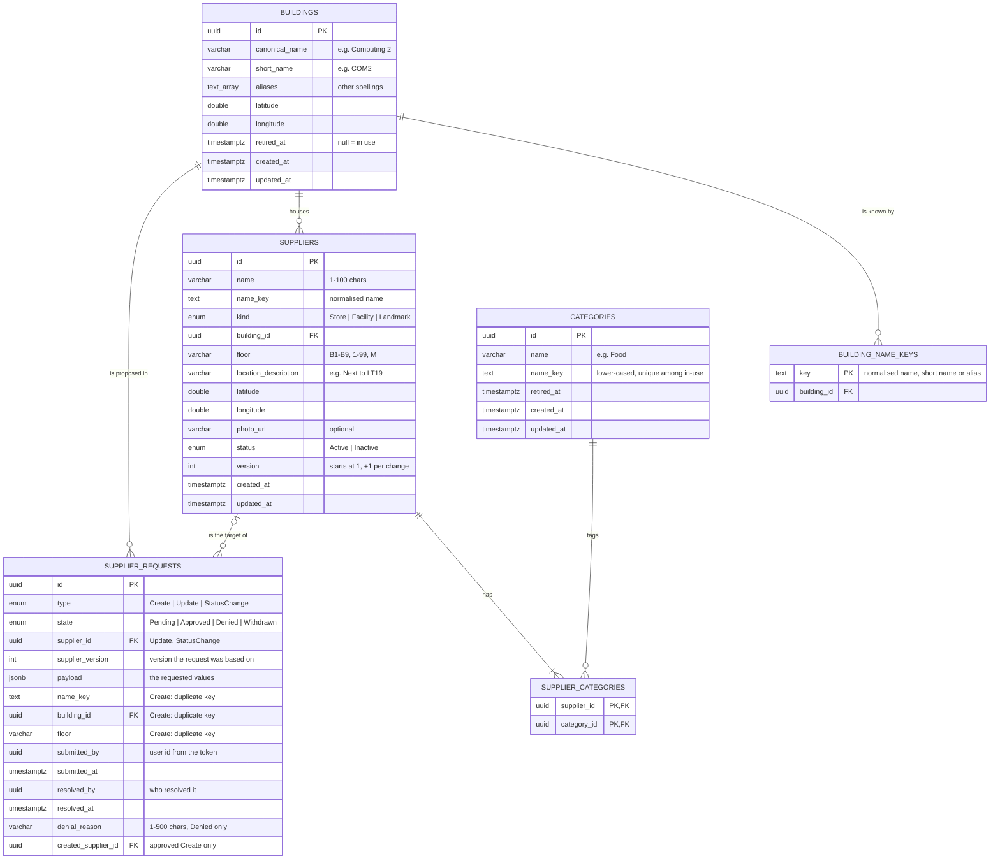
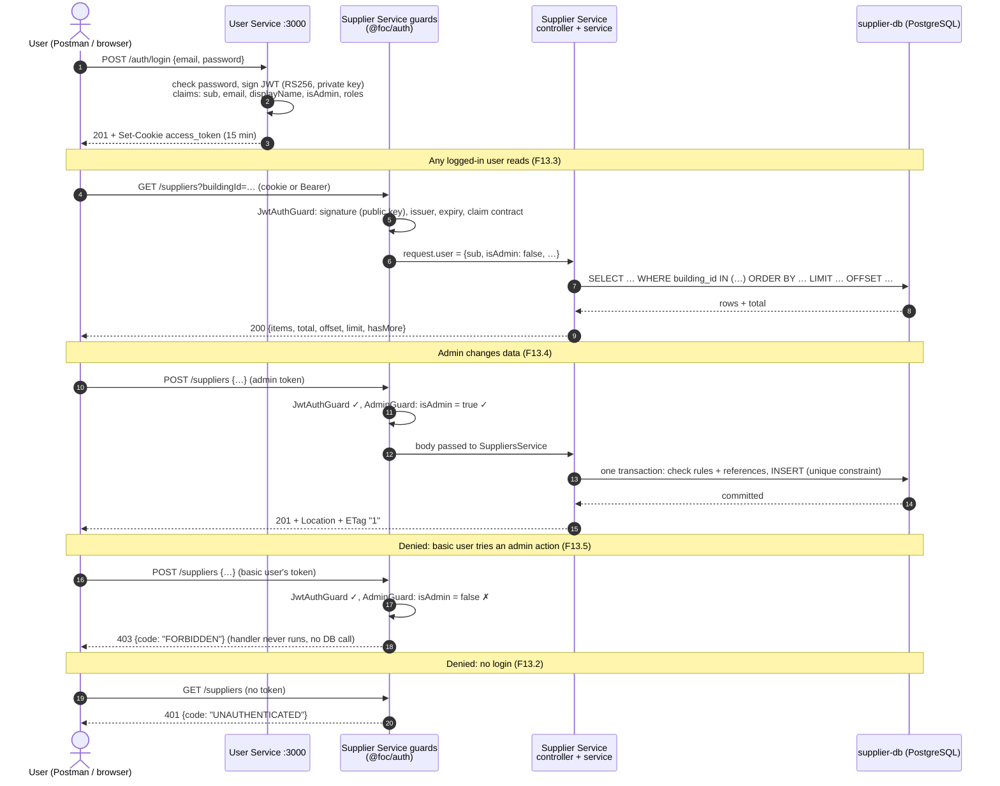
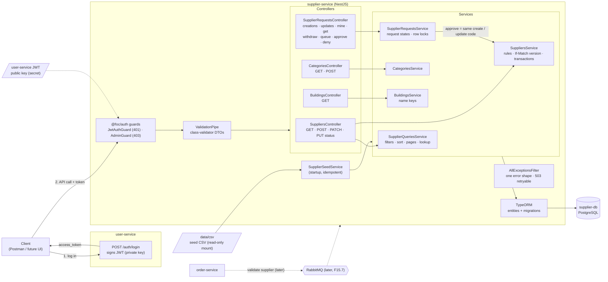
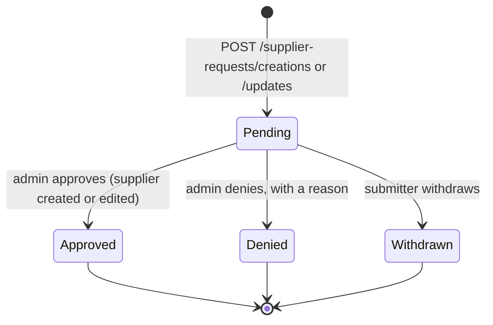

# Supplier Service (M.2)

The Supplier Service is FoC's source of truth for **suppliers**: the physical places on campus where errand items are picked up (a shop, a facility such as a printer, or a landmark). A supplier is a **pickup point, not a shop front**. There are no menus, products, stock or prices; those are out of scope in the project brief.

Other services use it like this:

- **Users** browse and search suppliers when creating an errand.
- **Users** ask for a missing supplier to be added, or for a wrong one to be corrected; an admin approves or denies the request.
- **Admins** add, edit and deactivate suppliers, and manage categories and buildings.
- **Order Service** checks a supplier's current details and status when an errand references it.

**Contents**:

1. [Scope for D2](#1-scope-for-d2)
2. [Tech stack, compared with the other services](#2-tech-stack-compared-with-the-other-services)
3. [D2 point 1: Database choice and schema](#3-d2-point-1-database-choice-and-schema)
4. [D2 point 2: Query patterns and API](#4-d2-point-2-query-patterns-and-api)
5. [D2 points 2 and 4: Identity and roles from User Service](#5-d2-points-2-and-4-identity-and-roles-from-user-service)
6. [D2 point 3: CRUD without a UI](#6-d2-point-3-crud-without-a-ui)
7. [D2 point 4: End-to-end demo script](#7-d2-point-4-end-to-end-demo-script)
8. [Build plan](#8-build-plan)
9. [Dependencies and risks](#9-dependencies-and-risks)
10. [Running and testing](#10-running-and-testing)

---

## 1. Scope for D2

D2 asks for Supplier Service **"significant progress"**: Part 2 points 1-4 of the D2 instructions. There is **no UI** for D2; point 5 (a responsive UI) comes later.

| D2 point | What we show | Requirements (FR v2) |
|---|---|---|
| 1. DB choice + schema + metadata | PostgreSQL, the six tables, how name, type and location are stored and queried | F1, F4, F11, F12 |
| 2. Query patterns + API + identity/roles | List, search, filter, sort, paginate and get-one through working API calls; how the user-service login is checked; what a denied request looks like | F5, F15.1-F15.5, F13 |
| 3. CRUD through the API alone | Create, read, update, and "delete" (= set Inactive) with no UI running | F7.5, F8.6, F9, F14.1, F14.3 |
| 4. Authenticated user → API → DB, roles differ | A basic user and an admin run the same calls and get different answers; a basic user asks for a supplier and an admin approves it | F13, F6, F7 + demo accounts + API collection |

**Not in D2** (designed, built later):

- **the rest of moderation:** status-change requests (F9.3, F9.4). Requests to *add* or *edit* a supplier, and following and withdrawing your own, are built (F6.1-F6.8, F7.1-F7.3.1, F8.1-F8.4.1, F13.6); admins amending a request before approving it (F7.4, F8.5) comes after D2.
- opening hours (F2)
- brands (F3)
- Order validation over RabbitMQ (F15.7)
- safe retries, audit log and rate limits (F14.2, F14.4, F16)
- images (F17)
- hard delete (F10)

---

## 2. Tech stack, compared with the other services

Consistency with the rest of the team comes first. New libraries need a stated reason.

| Concern | Supplier Service | Same as | Notes |
|---|---|---|---|
| Framework | NestJS 12, TypeScript, ES modules ✅ | user-service, credit-service, order-service | |
| Database | PostgreSQL 18 (`postgres:18-alpine`), own container `supplier-db` ✅ | user-service, credit-service, order-service | One database per service |
| Talking to the DB | TypeORM ✅ | user-service, credit-service | order-service's open PR uses Drizzle instead |
| Creating tables | TypeORM **migration files**, applied on startup; `synchronize` is always off ✅ | credit-service (PR #592) | user-service uses `synchronize` |
| Config checks at startup | Joi schema; the app refuses to start on bad settings ✅ | user-service | |
| Request validation | class-validator DTOs through one global `ValidationPipe` ✅ | user-service | **Difference:** we *reject* unknown fields instead of silently dropping them (F1.6, F1.3.2) |
| Error format | One JSON shape for every error ✅ | none (others use Nest defaults) | Needed by F1.6.1, F14.1.1, F15.3; extends Nest's default fields |
| Login check | The team's shared `@foc/auth` guards (RS256, public key only) over `@foc/contracts` ✅ | user-service (same package, scripts and `cookie-parser` in `main.ts`) | No token code is copied |
| Tests | vitest (unit + e2e), supertest ✅ | user-service | DB-backed e2e uses a throwaway Postgres, like credit-service |
| Lint | oxlint (type-aware) ✅ | user-service | |
| Docker | Multi-stage Dockerfile built from the repo root, `compose.yml` included from the root `compose.yaml` ✅ | order-service scaffold (9253390); repo-root context as in user-service | The root context lets the image build `packages/contracts` and `packages/auth` |

---

## 3. D2 point 1: Database choice and schema

### Why PostgreSQL

Full reasoning, alternatives and consequences: [ADR 0001](../docs/adr/supplier-service/0001-database-choice.md).

- **The data is structured and fixed.** Every supplier has the same fields: name, kind, building, floor, location, coordinates and status. There are no free-form documents.
- **It is relational.** Suppliers *reference* buildings and categories, and a supplier can have several categories. The database must refuse a reference to something that doesn't exist.
- **The database enforces the rules, not only the code.** Two admins submitting the same supplier at the same moment must not both succeed (F1.5.2). A unique constraint in the database guarantees that, and a code check alone can't.
- **Transactions.** Every write is all-or-nothing (F14.1).
- **The queries are filter + sort + paginate**, which SQL and indexes do well. Search is by name, building, category, kind and status, with stable page boundaries.
- **The scale is small.** There are a few hundred suppliers on one campus, so one Postgres instance is plenty. Reads dominate, and more service replicas can share the same database.
- **The team already runs it.** user-service and credit-service use PostgreSQL, so we reuse the same image, tooling and knowledge.

**Database per service:** Supplier Service owns `supplier-db` and no other service reads it. Other services ask through the API (and, later, RabbitMQ). This keeps each service's tables private, so they can change without breaking anyone.

### Schema (✅ step 3: `src/database/entities/`, migration `src/database/migrations/1790467200000-create-supplier-schema.ts`)


```mermaid
erDiagram
    BUILDINGS ||--o{ BUILDING_NAME_KEYS : "is known by"
    BUILDINGS ||--o{ SUPPLIERS : "houses"
    SUPPLIERS ||--|{ SUPPLIER_CATEGORIES : "has"
    CATEGORIES ||--o{ SUPPLIER_CATEGORIES : "tags"

    BUILDINGS {
        uuid id PK
        varchar canonical_name "e.g. Computing 2"
        varchar short_name "e.g. COM2"
        text_array aliases "other spellings"
        double latitude
        double longitude
        timestamptz retired_at "null = in use"
        timestamptz created_at
        timestamptz updated_at
    }
    BUILDING_NAME_KEYS {
        text key PK "normalised name, short name or alias"
        uuid building_id FK
    }
    CATEGORIES {
        uuid id PK
        varchar name "e.g. Food"
        text name_key "lower-cased, unique among in-use"
        timestamptz retired_at
        timestamptz created_at
        timestamptz updated_at
    }
    SUPPLIERS {
        uuid id PK
        varchar name "1-100 chars"
        text name_key "normalised name"
        enum kind "Store | Facility | Landmark"
        uuid building_id FK
        varchar floor "B1-B9, 1-99, M"
        varchar location_description "e.g. Next to LT19"
        double latitude
        double longitude
        varchar photo_url "optional"
        enum status "Active | Inactive"
        int version "starts at 1, +1 per change"
        timestamptz created_at
        timestamptz updated_at
    }
    SUPPLIER_CATEGORIES {
        uuid supplier_id PK, FK
        uuid category_id PK, FK
    }
    SUPPLIERS |o--o{ SUPPLIER_REQUESTS : "is the target of"
    BUILDINGS ||--o{ SUPPLIER_REQUESTS : "is proposed in"
    SUPPLIER_REQUESTS {
        uuid id PK
        enum type "Create | Update | StatusChange"
        enum state "Pending | Approved | Denied | Withdrawn"
        uuid supplier_id FK "Update, StatusChange"
        int supplier_version "version the request was based on"
        jsonb payload "the requested values"
        text name_key "Create: duplicate key"
        uuid building_id FK "Create: duplicate key"
        varchar floor "Create: duplicate key"
        uuid submitted_by "user id from the token"
        timestamptz submitted_at
        uuid resolved_by "who resolved it"
        timestamptz resolved_at
        varchar denial_reason "1-500 chars, Denied only"
        uuid created_supplier_id FK "approved Create only"
    }
```

| Table | Purpose | Rules the database enforces |
|---|---|---|
| `suppliers` | One row per pickup point | `UNIQUE (name_key, building_id, floor)` blocks duplicates, even when two requests race (F1.5, F1.5.2). CHECKs on name length, floor format, non-blank location and coordinate ranges. `building_id` must exist. |
| `buildings` | The controlled list of campus buildings (F4) | Coordinate range CHECKs |
| `building_name_keys` | Every name, short name and alias of each in-use building, normalised | The primary key makes two in-use buildings sharing a name impossible (F4.2). Looking up a building by any name is one key lookup (F4.5). |
| `categories` | The controlled list of categories (F11) | Partial unique index on `name_key` among non-retired categories (F11.2.1) |
| `supplier_categories` | Which categories each supplier has (many-to-many) | The primary key stops the same category being added twice (F1.2.3). A category in use can't be removed. |
| `supplier_requests` (✅ step 8, migration `1790640000000-create-supplier-requests.ts`) | A basic user's request to add (and later edit or change the status of) a supplier, moderated by an admin (F6) | A partial unique index on `(name_key, building_id, floor)` among **Pending Create** requests: two identical requests can't both be pending, even when filed at the same moment (F7.2). Another on `(supplier_id, type)` among Pending non-Create requests: one pending edit per supplier (F8.3; migration `1790726400000-add-pending-target-index.ts`). CHECKs: a Create carries the duplicate key and no target supplier, the other types the reverse; Pending means no resolver, and a resolved request always records who and when; only a Denied request has a reason, never blank (F6.4). |

Rules the database **can't** express are checked in the service, inside the same transaction:
- **"at least one category"** (F1.2.3)
- **"coordinates inside the NUS campus box"** (F1.2.7): the box comes from configuration, which a DB CHECK can't read
- **"only non-retired buildings and categories for new values"** (F1.8)

**System-managed fields** (`id`, `status`, `version`, `created_at`, `updated_at`) are set only by the server. A request that tries to set one is rejected (F1.3, F1.3.2).

**Retire, don't delete:** buildings and categories are *retired* (`retired_at` is set), never deleted. Suppliers that already use them keep working, but they can't be chosen for new data (F1.8, F4.3.1, F11.3).

**Why UUIDs, not auto-increment ids:**

- F1.1 requires suppliers to have "a unique, system-generated, immutable identifier (UUID)", never reused and not derived from the name or location.
- Other services store our ids: order-service's `errands.supplier_id` is a `uuid` column. credit-service also uses UUIDs.
- Ids appear in URLs (`/suppliers/{id}`). Sequential numbers would let anyone count or step through every record; UUIDs reveal nothing.
- The service creates the id before saving, which keeps transactions and the seed import simple.
- The cost (16 bytes instead of 4-8, for a few hundred rows) is negligible. Buildings and categories use UUIDs too, so every id in this service works the same way.

**Aliases vs `building_name_keys`:** a building has one full name, one short name and zero or more aliases, and can be found by any of them (F4.1, F4.5).

- `buildings.aliases` is the record: genuinely different names as typed, e.g. `"Terrace"` for COM3, which admins see and edit. Spelling variants don't need aliases (see below).
- `building_name_keys` is derived from it, like an index: one row per name (full, short and every alias), lower-cased with spaces removed and every apostrophe style made the same, for in-use buildings only. It is rebuilt whenever a building's names change. So "COM2", "Com 2" and "com2" are one name, as are "Prince George's Park" and "Prince George’s Park".
- It exists because F4.2 forbids two in-use buildings sharing **any** name. A normal unique index can't span three columns plus every item in a list, but a primary key on one row per name can, so the database itself enforces the rule.

### How the D2 metadata is stored and queried

| Metadata | Stored as | Queried by |
|---|---|---|
| **Name** | `name` as typed, plus `name_key`: trimmed, spaces collapsed, lower-cased and Unicode-normalised | Case-insensitive partial match on `name_key` |
| **Type** | `kind` (Store / Facility / Landmark, one per supplier) **and** categories (Food, Coffee…, one or more, via `supplier_categories`) | `?kind=` and `?categoryId=`, each accepting several values |
| **Location** | building (reference) + floor + a short "how to find it" description + map coordinates | `?buildingId=` |
| **Display name** | Not stored; derived as `"<Name> @ <Building short name>"`, e.g. `Cool Spot @ COM3` | Default sort key |

### Seed data (✅ step 4: `src/seed/`)

- **Source:** `data/csv/supplier-seed-data.csv`, 21 rows. Columns: Name, Type, Building, Floor, Location Description, Latitude, Longitude, StartingTime, ClosingTime, ImageURL. Compose mounts `data/csv` read-only; the file is never copied.
- **Loaded on startup** (`SEED_ON_STARTUP`, default on). Each row goes through the same `SuppliersService.create` as the admin API, so seed data obeys every rule (F12.3).
- **Safe to run again:** rows already present are skipped, keyed by the duplicate rule (F12.1). Even two copies seeding at once end with exactly 21. The log shows e.g. `seed: 0 created, 21 already present, 0 rejected`.
- **Buildings:** the 14 initial buildings (`src/seed/reference-data.ts`) resolve every building spelling in the file (F12.2.1). Case, spaces and apostrophe style are ignored automatically, so "Com 2", "Com2" and "COM2" all match COM2, and "Prince George’s Park" (curly apostrophe) matches PGP. The only alias needed is "Terrace" → COM3: the Terrace is the food court inside COM3, and the data file uses it as a building. Building coordinates are the average of each building's seed suppliers, fixed once.
- **Names:** an own-building suffix is removed ("Printer @ Com 2" → "Printer", shown as "Printer @ COM2"; F12.2.6). The Terrace outlets are named "InstaChef (Terrace)" and "Smooy (Terrace)", so they stay distinct from other outlets of the same business in COM3.
- **Kind:** "Printer @ Com 2" is a Facility; everything else is a Store (F12.2.5).
- **"Food/Coffee"** becomes two categories, created if missing (F12.2.2).
- **Bad characters** from Windows-1252 encoding are repaired, e.g. `George\x92s` → `George’s` (F12.3).
- **A bad row** is skipped and logged with its row number, field and reason; it never stops the import (F12.4).
- **Photos** are stored where the ImageURL cell has one, otherwise none (F12.2.4). **Opening hours** in the file are ignored until step 13.

---

## 4. D2 point 2: Query patterns and API

Built so far ✅: `GET /health`; `GET`/`POST /categories` (step 2); `GET /suppliers`, `GET /suppliers/{id}`, `GET /buildings` (step 5); `POST /suppliers`, `PATCH /suppliers/{id}`, `PUT /suppliers/{id}/status` (step 6); and the `/supplier-requests` endpoints for moderated changes (steps 8-10, 12; see [§6](#6-d2-point-3-crud-without-a-ui)). Category rename/retire, building management and status-change requests are planned for after D2.

**How to call it:**

- base URL `http://localhost:3002`
- JSON in and out
- the login cookie `access_token` comes from user-service; see [§5](#5-d2-points-2-and-4-identity-and-roles-from-user-service)

### Query patterns

| Pattern | Call | FR |
|---|---|---|
| Get one supplier by id | `GET /suppliers/{id}` | F5.9 |
| Search by name (partial, any case) | `GET /suppliers?name=cool` | F5.4.1 |
| By location (building) | `GET /suppliers?buildingId={id}` (repeatable) | F5.4.3 |
| By category | `GET /suppliers?categoryId={id}` (repeatable; matches any) | F5.4.2 |
| By kind | `GET /suppliers?kind=Store` (repeatable) | F5.4.4 |
| By status | `GET /suppliers?status=Active` (default: both) | F5.4.5, F5.7 |
| Combined | `GET /suppliers?categoryId={food}&buildingId={com3}&status=Active`: filters are ANDed | F5.5 |
| Sort | Default: display name A→Z, then id, or `?sort=name\|building\|createdAt\|updatedAt&order=asc\|desc`, always ending with id as the tie-breaker | F5.3, F5.3.1 |
| Pages | `?offset=0&limit=25` (max 1000) | F5.2, N3.1 |

Repeatable filters are passed by repeating the parameter, e.g. `?categoryId=a&categoryId=b`. Sorting uses the database's English collation (case- and punctuation-aware dictionary order).

**Behaviour:**

- **No match** returns `200` with an empty list and `total: 0`, not a 404 (F5.6).
- **An unknown query parameter,** or a category or building id that doesn't exist, returns `400`, not silently ignored (F5.8).
- **Filtering by a retired category or building** returns an empty list (F5.8.1).

**List response:**

```json
{
  "items": [
    {
      "id": "7c9e…",
      "displayName": "Cool Spot @ COM3",
      "name": "Cool Spot",
      "brand": null,
      "kind": "Store",
      "categories": [{ "id": "…", "name": "Food" }],
      "building": { "id": "…", "shortName": "COM3" },
      "floor": "1",
      "status": "Active",
      "isOpenNow": null,
      "thumbnailUrl": null
    }
  ],
  "total": 21,
  "offset": 0,
  "limit": 25,
  "hasMore": false
}
```

- `brand` stays `null` until brands (step 14).
- `isOpenNow` stays `null` ("not applicable", F2.5.1) until opening hours (step 13).
- With no photo, `thumbnailUrl` is the placeholder link from the `PLACEHOLDER_IMAGE_URL` setting (F1.2.9). The setting is blank until images are hosted (step 19), so for now it is `null`.

**Single supplier (`GET /suppliers/{id}`)** returns every list field plus:

- `building.canonicalName`, `locationDescription`, `coordinates {latitude, longitude}`
- `openingHours`, `nextChangeAt` (null for now)
- `images: {original, thumbnail}`: the photo for both until thumbnails exist (F17.3), the placeholder when there's no photo, or `null` when neither is set
- `version`, `createdAt`, `updatedAt`

It also returns the version in an `ETag` header (e.g. `"3"`), which an admin edit must send back as `If-Match` (step 6). A malformed id answers 400 (`VALIDATION_FAILED`, field `id`); an unknown one 404 `SUPPLIER_NOT_FOUND`. This response is also what other services rely on: it has enough detail for them to keep their own copy (F15.1). The endpoint is read-only, so it is safe to retry (F15.4).

### Endpoints

| Method | Path | Who | What | FR |
|---|---|---|---|---|
| GET | `/health` | anyone, no login | Is the service up? ✅ | |
| GET | `/suppliers` | any logged-in user | List / search / filter / sort / paginate | F5 |
| GET | `/suppliers/{id}` | any logged-in user | One supplier in full | F5.9, F15.1 |
| POST | `/suppliers` | **admin** | Create (starts Active) | F7.5, F9.1 |
| PATCH | `/suppliers/{id}` | **admin** | Edit some fields; needs `If-Match` | F8.6, F14.3 |
| PUT | `/suppliers/{id}/status` | **admin** | Set Active / Inactive; needs `If-Match` | F9.2, F9.5 |
| GET | `/categories` | any logged-in user | In-use categories | F11.4 |
| POST | `/categories` | **admin** | Create a category | F11.2 |
| PATCH | `/categories/{id}` | **admin** | Rename (after D2) | F11.2 |
| POST | `/categories/{id}/retire` | **admin** | Retire (after D2) | F11.3 |
| GET | `/buildings` | any logged-in user | In-use buildings with names and coordinates | F4.4 |
| POST | `/buildings` | **admin** | Create a building (after D2) | F4.3 |
| PATCH | `/buildings/{id}` | **admin** | Rename or change aliases (after D2) | F4.3 |
| POST | `/buildings/{id}/retire` | **admin** | Retire (after D2) | F4.3.1 |
| POST | `/supplier-requests/creations` | any logged-in user | Ask for a supplier to be added (same body as `POST /suppliers`); 201, Pending | F7.1, F7.2 |
| POST | `/supplier-requests/updates` | any logged-in user | Ask for a supplier to be edited: `{"supplierId": "...", "changes": {...same fields as PATCH...}}` with `If-Match`; 201, Pending | F8.1-F8.3 |
| GET | `/supplier-requests?type=&offset=&limit=` | **admin** | Pending requests, oldest first, paged | F6.7 |
| GET | `/supplier-requests/mine?type=&state=&offset=&limit=` | any logged-in user | Their own requests, every type and state, newest first, paged; includes denial reasons | F6.5 |
| GET | `/supplier-requests/{id}` | the submitter or an **admin** | One request; anyone else gets 404, exactly as for an unknown id | F13.6 |
| POST | `/supplier-requests/{id}/withdraw` | the submitter only | Withdraw a Pending request; anyone else gets 404 | F6.6, F13.6 |
| POST | `/supplier-requests/{id}/approve` | **admin** | Approve: creates the supplier, or applies the edit | F6.3, F6.8, F7.3, F8.4 |
| POST | `/supplier-requests/{id}/deny` | **admin** | Deny, with `{"reason": "..."}` (1-500 chars) | F6.4 |

`retire` is a `POST` action rather than `DELETE`, so it can't be confused with deleting data.

### Errors

Every error, from any endpoint, has one shape (✅ built in `src/common/errors/`):

```json
{
  "statusCode": 400,
  "error": "Bad Request",
  "message": "Request validation failed.",
  "code": "VALIDATION_FAILED",
  "violations": [
    { "field": "floor", "reason": "floor must be B1-B9, 1-99 or M" },
    { "field": "name", "reason": "name must be 1-100 characters" }
  ]
}
```

- `code` is for programs; `message` is for people.
- `violations` lists **every** bad field at once (F1.6.1).
- `retryable: true` marks a temporary failure. It comes with a `Retry-After` header.

| Status | `code` | When |
|---|---|---|
| 400 | `VALIDATION_FAILED` ✅ | Bad or unknown fields or query parameters |
| 401 | `UNAUTHENTICATED` ✅ | No login cookie, or the token is invalid or expired |
| 403 | `FORBIDDEN` ✅ | Logged in, but not an admin, on an admin endpoint |
| 404 | `NOT_FOUND` / `SUPPLIER_NOT_FOUND` / `REQUEST_NOT_FOUND` ✅ | Unknown id (F5.9.1), or someone else's request (F13.6) |
| 409 | `DUPLICATE_SUPPLIER`, `DUPLICATE_NAME`, `VERSION_CONFLICT`, `INVALID_STATUS_TRANSITION`, `DUPLICATE_REQUEST`, `REQUEST_ALREADY_RESOLVED` ✅ | Same name+building+floor exists; the name is taken; someone else edited first (includes `currentVersion`); already in that status; an identical request (or another edit of the same supplier) is already pending; the request was already approved or denied |
| 413 | `PAYLOAD_TOO_LARGE` ✅ | Request body too big |
| 428 | `PRECONDITION_REQUIRED` ✅ | An edit sent without `If-Match` |
| 503 | `DEPENDENCY_UNAVAILABLE` ✅ (`retryable: true`) | The database can't be reached. Never reported as "not found" (F15.3). |
| 500 | `INTERNAL_ERROR` ✅ | Unexpected. Details are logged, never sent to the client. |

---

## 5. D2 points 2 and 4: Identity and roles from User Service

✅ step 2. Verification uses the team's shared `@foc/auth` package (`packages/auth`), built on the token contract in `@foc/contracts`, exactly as user-service does.

**How it works:**

1. The user logs in at user-service: `POST localhost:3000/auth/login`.
2. user-service sets an httpOnly cookie `access_token`: a JWT signed with **RS256** using user-service's **private** key. It has issuer `user-service` and lasts 15 minutes.
3. The browser (or Postman) sends that cookie to `localhost:3002` too, because cookies are matched by host, not port.
4. Supplier Service **verifies the token itself** with user-service's **public** key, mounted as a Docker secret (`JWT_PUBLIC_KEY_FILE`). Compose reads it from user-service's own key file (`../user-service/jwt_public_key.secret`, overridable with `SUPPLIER_JWT_PUBLIC_KEY_PATH`), so both services always use the same key pair. No call to user-service is needed per request, and the private key never leaves user-service. `cookie-parser` (in `main.ts`, as in user-service) turns the Cookie header into `request.cookies` for the guard.
5. It then checks the token's contents with `validateAccessTokenPayload` from `@foc/contracts`. The claims are `sub` (user id), `email`, `displayName`, `isAdmin`, `roles`, `iss`, `iat` and `exp`.
6. **Admin = `isAdmin: true` in the token.** `roles` (requester/courier) are errand roles and don't change supplier permissions. The FRs only distinguish Basic vs Admin (F13.3, F13.4).
7. Identity comes **only** from the verified token, never from the request body (F13.1).

**Guards run before anything else** (before validation and before the handler). Each controller applies `@UseGuards(JwtAuthGuard)`, and admin-only routes add `AdminGuard`, as in user-service:

- no cookie, a bad signature, the wrong issuer, expired, or bad contents → **401** (F13.2)
- valid, but not an admin on an admin endpoint → **403**, and the handler never runs (F13.5)
- `/health` is the only route without a guard. An e2e test lists every registered route and fails if any other one answers without a token, so a forgotten guard is caught


```mermaid
sequenceDiagram
    autonumber
    actor U as User (Postman / browser)
    participant US as User Service :3000
    participant G as Supplier Service guards<br/>(@foc/auth)
    participant SS as Supplier Service<br/>controller + service
    participant DB as supplier-db (PostgreSQL)

    U->>US: POST /auth/login {email, password}
    US->>US: check password, sign JWT (RS256, private key)<br/>claims: sub, email, displayName, isAdmin, roles
    US-->>U: 201 + Set-Cookie access_token (15 min)

    Note over U,DB: Any logged-in user reads (F13.3)
    U->>G: GET /suppliers?buildingId=… (cookie or Bearer)
    G->>G: JwtAuthGuard: signature (public key), issuer, expiry, claim contract
    G->>SS: request.user = {sub, isAdmin: false, …}
    SS->>DB: SELECT … WHERE building_id IN (…) ORDER BY … LIMIT … OFFSET …
    DB-->>SS: rows + total
    SS-->>U: 200 {items, total, offset, limit, hasMore}

    Note over U,DB: Admin changes data (F13.4)
    U->>G: POST /suppliers {…} (admin token)
    G->>G: JwtAuthGuard ✓, AdminGuard: isAdmin = true ✓
    G->>SS: body passed to SuppliersService
    SS->>DB: one transaction: check rules + references, INSERT (unique constraint)
    DB-->>SS: committed
    SS-->>U: 201 + Location + ETag "1"

    Note over U,DB: Denied: basic user tries an admin action (F13.5)
    U->>G: POST /suppliers {…} (basic user's token)
    G->>G: JwtAuthGuard ✓, AdminGuard: isAdmin = false ✗
    G-->>U: 403 {code: "FORBIDDEN"} (handler never runs, no DB call)

    Note over U,DB: Denied: no login (F13.2)
    U->>G: GET /suppliers (no token)
    G-->>U: 401 {code: "UNAUTHENTICATED"}
```


```mermaid
flowchart LR
    client["Client<br/>(Postman / future UI)"]
    subgraph US["user-service"]
      login["POST /auth/login<br/>signs JWT (private key)"]
    end
    subgraph SS["supplier-service (NestJS)"]
      guards["@foc/auth guards<br/>JwtAuthGuard (401) · AdminGuard (403)"]
      pipe["ValidationPipe<br/>class-validator DTOs"]
      subgraph C["Controllers"]
        sc["SuppliersController<br/>GET · POST · PATCH · PUT status"]
        cc["CategoriesController<br/>GET · POST"]
        bc["BuildingsController<br/>GET"]
        rc["SupplierRequestsController<br/>creations · updates · mine · get<br/>withdraw · queue · approve · deny"]
      end
      subgraph S["Services"]
        reads["SupplierQueriesService<br/>filters · sort · pages · lookup"]
        writes["SuppliersService<br/>rules · If-Match version · transactions"]
        cats["CategoriesService"]
        blds["BuildingsService<br/>name keys"]
        reqs["SupplierRequestsService<br/>request states · row locks"]
      end
      seed["SupplierSeedService<br/>(startup, idempotent)"]
      filter["AllExceptionsFilter<br/>one error shape · 503 retryable"]
      orm["TypeORM<br/>entities + migrations"]
    end
    db[("supplier-db<br/>PostgreSQL")]
    csv[/"data/csv<br/>seed CSV (read-only mount)"/]
    key[/"user-service JWT<br/>public key (secret)"/]
    mq{{"RabbitMQ (later, F15.7)"}}
    order["order-service"]

    client -- "1. log in" --> login
    login -- "access_token" --> client
    client -- "2. API call + token" --> guards --> pipe --> C
    key -.-> guards
    sc --> reads
    sc --> writes
    cc --> cats
    bc --> blds
    rc --> reqs
    reqs -- "approve = same create / update code" --> writes
    S --> orm --> db
    csv --> seed --> S
    order -. "validate supplier (later)" .-> mq -.-> SS
```

**Stale claims trade-off:** a token can be up to 15 minutes old. If an admin is demoted, their token still says `isAdmin: true` until it expires. For D2 we trust the token and state the 15-minute window. The team's ADRs ([user-service 005](../docs/adr/user-service/005-user-roles-and-token-claims.md), [shared auth 0001](../docs/adr/shared-packages/0001-shared-auth-guards-package.md)) note that sensitive endpoints may need to check current state in the database; that is a team decision.

---

## 6. D2 point 3: CRUD without a UI

✅ step 6. Everything is done through the API; no UI is needed or running.

| CRUD | Call | Notes |
|---|---|---|
| **Create** | `POST /suppliers` | Admin. Full validation and duplicate check; field and reference problems come back together in one 400. Starts Active, version 1. Replies 201 with `Location` and `ETag`. |
| **Read** | `GET /suppliers`, `GET /suppliers/{id}` | Any logged-in user |
| **Update** | `PATCH /suppliers/{id}` with header `If-Match: "3"` | Admin. Only the fields sent change (`photoUrl: null` removes the photo; `categoryIds` replaces the list). The version goes up by 1, even when only categories change. An edit that would duplicate another supplier is 409 `DUPLICATE_SUPPLIER`. A retired building or category the supplier already has may stay; only newly chosen ones must be in use (F1.8). |
| **Delete (D2)** | `PUT /suppliers/{id}/status {"status":"Inactive"}` with `If-Match` | Admin. The supplier stays in the database, tagged Inactive, and can be re-activated. Errands already created are unaffected (F9.6). |

**Why "delete" means Inactive for D2:** permanent deletion (F10) has to check with Order Service that no errand ever used the supplier, and needs the admin to re-enter their password through User Service. Neither exists yet, so hard delete is scheduled last (step 21). Deactivating is also the everyday way to remove a supplier, because it keeps errand history intact.

**Lost-update protection (F14.3):**

- Every edit must say which version it was based on, using `If-Match`.
- If someone changed the supplier in the meantime, the edit is refused with **409 `VERSION_CONFLICT`** and `currentVersion`, instead of silently overwriting their change. The row is locked while it is checked and changed, so of two edits sent at once with the same version, exactly one wins.
- Setting the status it already has is **409 `INVALID_STATUS_TRANSITION`** (F9.2).
- Missing `If-Match` → **428**.

**All-or-nothing writes (F14.1):** each write runs in one database transaction. A failure saves nothing.

**How to run it:** the Postman collection in [`api/`](api/README.md), folder 3 "CRUD as admin". No UI is needed or running.

### Moderated changes: basic users ask, admins decide (✅ steps 8-10, 12)

A basic user can't create or edit a supplier directly, but can **ask** for one to be added or edited. An admin then approves or denies the request.


```mermaid
stateDiagram-v2
    [*] --> Pending: POST /supplier-requests/creations or /updates
    Pending --> Approved: admin approves (supplier created or edited)
    Pending --> Denied: admin denies, with a reason
    Pending --> Withdrawn: submitter withdraws
    Approved --> [*]
    Denied --> [*]
    Withdrawn --> [*]
```

- **Filing (F7.1, F7.2):** the body is validated exactly like an admin's `POST /suppliers`, with every problem in one 400. It is refused with 409 `DUPLICATE_SUPPLIER` if the supplier already exists, or 409 `DUPLICATE_REQUEST` if an identical request is already pending (enforced by the database, so it holds even for two requests filed at once). The submitter comes only from the token (F13.1). The supplier **doesn't exist yet**, so it isn't listed.
- **Approving (F6.3, F6.8, F7.3):** runs the same create code as `POST /suppliers`, in the **same transaction** as marking the request Approved. Everything is checked again at that moment: if an admin created the same supplier meanwhile (409 `DUPLICATE_SUPPLIER`), or the building was retired (400), nothing changes and the request stays Pending.
- **Edit requests (F8.1-F8.4.1):** `changes` holds the same fields as an admin `PATCH` and is checked by the same rules, including whether the edited record would duplicate another supplier. Like an admin edit, it must send the version the user saw in `If-Match` (428 if missing, 409 `VERSION_CONFLICT` if already out of date). Only the fields sent are stored. The live supplier keeps being listed unchanged until approval (F8.2), and a supplier has at most one pending edit (F8.3, a partial unique index). Approving runs the same code as `PATCH` with the request's recorded version, so if the supplier changed after the request was filed, approval is refused with 409 `VERSION_CONFLICT` and nothing changes (F8.4.1). Until admins can amend a request (F8.5, after D2), the admin denies a stale one and the user files it again.
- **Denying (F6.4):** needs a reason of 1-500 characters, stored with who denied it and when.
- **Following your own requests (F6.5, F6.6, F13.6):** `GET /supplier-requests/mine` lists the caller's requests of every type and state, newest first, with denial reasons. A Pending one can be withdrawn by its submitter only, which frees its slot so the same request can be filed again. Someone else's request, whether viewed or withdrawn, gets the **same 404 as an id that doesn't exist**, so ids reveal nothing. Admins can view any request, but withdraw only their own; they reject other people's by denying them.
- **Exactly once (F6.3):** the request row is locked while it is resolved, so of two people acting at once (two admins, or an admin approving while the submitter withdraws), one wins and the other gets 409 `REQUEST_ALREADY_RESOLVED`. The allowed moves are one small table (`src/requests/request-state.ts`); Approved, Denied and Withdrawn are final.

**User ids are UUIDs** (`submitted_by`, `resolved_by`), taken only from the verified token's `sub` (F13.1). They were first stored as text, while user-service ids were numbers; once user-service switched to UUIDs (#611), migration `1790899200000-store-user-ids-as-uuid.ts` made the columns `uuid`. A row with an old numeric id makes that migration fail and change nothing, instead of silently losing who acted. The ids are not foreign keys, because users live in user-service's database.

---

## 7. D2 point 4: End-to-end demo script

✅ step 7. The whole demo is a Postman collection: [`api/supplier-service.postman_collection.json`](api/README.md), run against `docker compose up` from the repo root. Every request checks its own result (green ticks). The same requests run as a basic user or an admin, with each user's token.

| Folder | As | What it shows | D2 |
|---|---|---|---|
| **0 Setup** | both | Log in at user-service; each user's token is saved | 4 |
| **1 Query patterns** | basic user | List with pagination → search by name → by building (location) → by category → combined + sorted → next page → one supplier with its `ETag` → 404 → 400 listing every bad parameter | 2 |
| **2 Denied requests** | nobody / basic user | No login → **401**; basic user creating, editing or deactivating a supplier, or creating a category → **403**, nothing changed | 2, 4 |
| **3 CRUD as admin** | admin | Create **201** (version 1) → same again **409** → every problem in one **400** → read back → edit without `If-Match` **428** → edit (version 2) → out-of-date edit **409** with `currentVersion` → deactivate, D2's "delete" (version 3) → again **409** → gone from the Active list → still readable, tagged Inactive | 3 |
| **4 Supplier requests** | basic user, then admin | Basic user asks for a supplier **201** Pending → same again **409** → not listed yet → basic user lists or approves requests **403** → admin lists pending → approves **200** (supplier created) → again **409** → now listed → basic user asks to edit it **201** → without `If-Match` **428** → a second edit **409** → live record unchanged → admin approves → edit applied, version 2 → a second creation request: deny with a blank reason **400**, then with a reason **200** → basic user lists their own requests (with the denial reason) and views the denied one → unknown request **404** → a third request: admin withdraws it **404** (not theirs), basic user withdraws it **200**, again **409** | 3, 4 |

---

## 8. Build plan

Branches are few and large: one per area, each merged into `supplier-service` by one PR.

| Step | What | FRs | Branch | Status |
|---|---|---|---|---|
| 1 | Scaffold: app, config, DB wiring, migrations, Docker, error format | groundwork for F1.7, F14.1.1, F15.3 | `scaffold` | ✅ merged (#598) |
| 2 | Auth: check the user-service login token; first endpoints `GET`/`POST /categories` | F13.1-F13.5, F11.2 (create), F11.4 | `auth` | ✅ built |
| 3 | Data model, categories, buildings (no endpoints yet) | F1.1, F1.2.1-F1.2.7, F1.2.9, F1.3-F1.8, F4.1, F4.2, F4.5, F11.1, F11.3 | `database` | ✅ built (services only; endpoints in `auth`/`crud`) |
| 4 | Seed import | F12.1, F12.2.1, F12.2.2, F12.2.4-F12.2.6, F12.3, F12.4 | `database` | ✅ built |
| 5 | Read: list, filter, sort, get one; category/building lists | F5.1-F5.9.1 (not F5.4.6/F5.4.7), F15.1-F15.5, F4.4, F11.4 | `crud` | ✅ built |
| 6 | Create, update, status (admin) | F7.5, F8.6, F9.1, F9.2, F9.5, F9.6, F14.1, F14.3 | `crud` | ✅ built (category/building admin after D2) |
| 7 | D2 deliverables: Postman collection, diagrams, DB-choice ADR (demo accounts: see §9) | none | `crud` | ✅ built |
| 8 | Request basics: the requests table, states, admin list, approve, deny | F6.1-F6.4, F6.7, F6.8 | `crud` | ✅ built |
| 9 | "Add supplier" requests | F7.1-F7.3.1 | `crud` | ✅ built (F7.4 amend: after D2) |
| 10 | "Edit supplier" requests | F8.1-F8.4.1 | `crud` | ✅ built (F8.5 amend: after D2) |
| 12 | My requests, withdraw | F6.5, F6.6, F13.6 | `crud` | ✅ built |
| 11 | "Change status" requests | F9.3, F9.3.1, F9.3.2, F9.4 | `crud` | 🔜 after D2 |

---

## 9. Dependencies and risks

| Risk | Impact | Owner / action |
|---|---|---|
| ~~user-service tokens lack `isAdmin` and `roles`~~ | ✅ Resolved by #600: login tokens carry `{sub, email, displayName, isAdmin, roles}` and pass the shared contract | none |
| ~~The bootstrap admin can't log in~~ (created Locked, random password) | ✅ Resolved by #609: a password reset sets a new password **and unlocks** the account, so the bootstrap admin can be activated (see [`api/README.md`](api/README.md#demo-accounts)) | none |
| ~~User ids change from numbers to UUIDs (#611)~~ | ✅ Done: tokens carry a UUID `sub`; request user-id columns migrated to `uuid` (`1790899200000-store-user-ids-as-uuid.ts`) | none |
| Hard delete needs Order's "is this supplier used?" check and User's password re-entry proof | No hard delete for D2 (deactivate instead) | Order + User, later sprints |
| The team hasn't decided on stale-claims handling | Explained as a trade-off in [§5](#5-d2-points-2-and-4-identity-and-roles-from-user-service) | Team decision |

---

## 10. Running and testing

**Run with the whole stack** (always from the **repo root**: Compose names the project after the folder it runs in, so the containers are `foc-supplier-service-1` and `foc-supplier-db-1`, image `foc-supplier-service`. Running `docker compose` inside `supplier-service/` would start a separate project named `supplier-service`, with its own empty database):

```sh
cp supplier-service/secrets/supplier_db_password.secret.example \
   supplier-service/secrets/supplier_db_password.secret   # then set a password
cp supplier-service/.env.example supplier-service/.env      # loaded by compose.yaml
docker compose up
```

Supplier Service also needs user-service's JWT key pair, set up as part of user-service (`user-service/jwt_public_key.secret`). Supplier Service only reads the public key, from that file; point `SUPPLIER_JWT_PUBLIC_KEY_PATH` elsewhere if needed.

| What | Where |
|---|---|
| Supplier Service | `http://localhost:3002` (`SUPPLIER_SERVICE_HOST_PORT`) |
| supplier-db | `localhost:5438` (`SUPPLIER_DB_HOST_PORT`) |
| Test database | `localhost:5439` (`SUPPLIER_DB_TEST_HOST_PORT`), only with the `test` profile |

Every setting has a default, so no `.env` file is needed to run it. All settings are listed in `supplier-service/.env.example`. The Docker-level ones use a `SUPPLIER_` prefix so they can't collide with other services' `DB_*` values, and `compose.yml` maps them onto the app's own names.

**Campus bounding box** (F1.2.7): supplier coordinates must lie inside it. Defaults: latitude 1.28–1.31, longitude 103.74–103.79 (covers every seed supplier). Set with `SUPPLIER_CAMPUS_MIN_LATITUDE`, `…_MAX_LATITUDE`, `…_MIN_LONGITUDE`, `…_MAX_LONGITUDE` (the app reads them as `CAMPUS_*`).

**Develop and test** (in `supplier-service/`):

```sh
npm install
npm run start:dev          # watch mode
npm run lint               # oxlint
npm test                   # unit tests
npm run test:e2e           # end-to-end tests (database faked)
npm run db:test:up         # start the throwaway test database (port 5439; needs Docker)
npm run test:integration   # tests against that real PostgreSQL: constraints, races, no schema drift
npm run db:test:down
npm run build
```

**Migrations** (tables are only ever changed through these):

```sh
npm run migration:generate -- src/database/migrations/<Name>
npm run migration:run
npm run migration:show
npm run migration:revert
```
Pending migrations are applied automatically on startup (`DB_MIGRATIONS_RUN`, default `true`).
